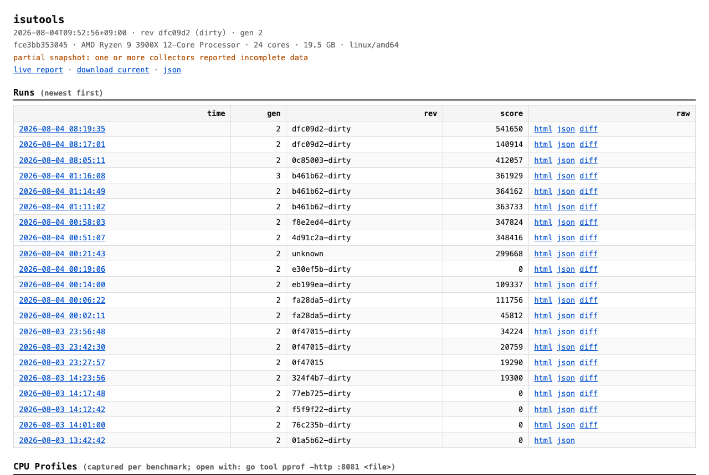
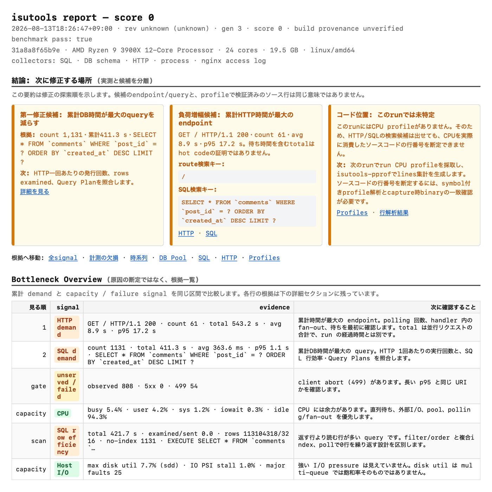
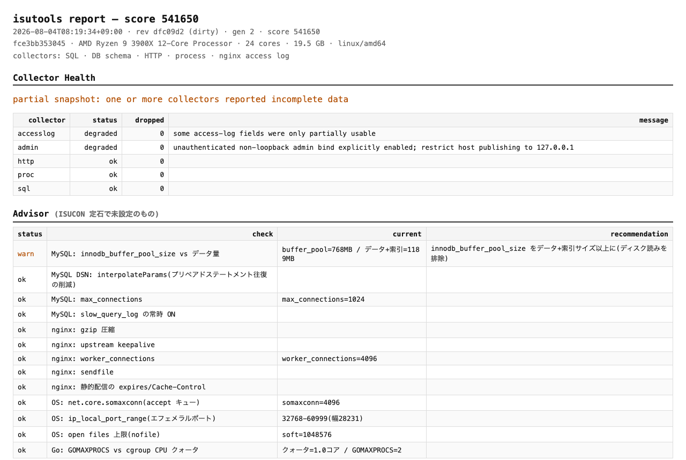
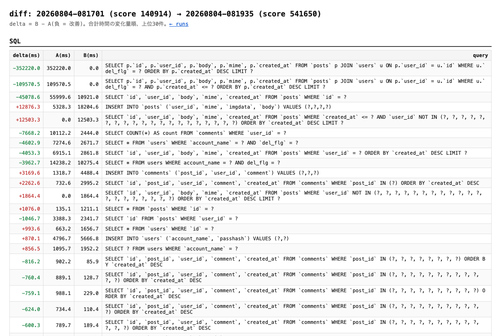

# isutools

[](https://pkg.go.dev/github.com/ekusiadadus/isutools)
[](https://github.com/ekusiadadus/isutools/actions/workflows/ci.yml)
[](./LICENSE)

**English** | [日本語](./README.md)

**Measure, compare, and review an ISUCON run in one dashboard.**

isutools is an all-in-one profiling module that integrates into a Go application with minimal changes. It captures SQL, HTTP, reverse-proxy logs, pprof, processes, host resources, network counters, and DB-pool statistics inside the same benchmark boundary, then saves the result with its score and git revision.



## Try it first

```go
import "github.com/ekusiadadus/isutools"

db, err = sqlx.Open(isutools.SQLDriverName("mysql"), dsn)
http.ListenAndServe(":8080", isutools.HTTP(handler))
```

The dashboard starts on `127.0.0.1:19191`. Keep it on loopback, connect through SSH forwarding, and wrap each benchmark in one reset/save boundary:

```bash
curl -fsS -X POST http://127.0.0.1:19191/reset
# benchmark command
curl -fsS -X POST 'http://127.0.0.1:19191/save?score=12345'
```

### Makefile for a remote private-isu host

The repository `Makefile` wraps readiness checks, a real benchmark, artifact
download over SCP, SSH port forwarding, and a manual CPU-profile capture for an
existing remote private-isu environment. Copy `.isutools.mk.example` to the
gitignored `.isutools.mk` and set only that environment's host and paths.

```bash
cp .isutools.mk.example .isutools.mk
$EDITOR .isutools.mk

make status
make check
make bench           # reset -> bench -> collect -> save -> SCP
make verify-results
make tunnel          # forward localhost:19191; Ctrl-C stops it
make pprof PPROF_SECONDS=30
```

Artifacts default to `~/isutools-private-isu-results`. `make pprof` uses the
manual `/pprof/profile` endpoint, so it stops on the expected 409 while managed
run CPU mode owns the process-wide profiler. Do not work around an SSH/Tunnel
failure by exposing the unauthenticated admin endpoint on `0.0.0.0:19191`.

On 2026-08-13, the complete workflow was rechecked over SSH against the existing
private-isu environment on Windows/WSL2: readiness, a real `make bench`, durable
snapshot download over SCP, manual pprof capture, and loopback port forwarding.
The score-0/pass-true run proves the integration path, not performance.

- [Verification commands, run ID, hashes, and limitations](./docs/private-isu-ssh-verification-20260813.md)



## What it answers first

- Which SQL statements and HTTP paths consume the run
- Whether indexes are avoiding unnecessary row reads
- Whether CPU, memory, disk, or network resources are saturated
- Whether requests wait on the database or the connection pool
- What changed between two runs in score, errors, total time, count, and average
- Whether missing or contaminated measurements make a run unsafe to compare

## Recorded dogfooding result

Using only isutools measurements, one day of private-isu tuning improved the score from **0 to 541,650 with zero failures**. This is a record from one controlled environment, not a general performance guarantee.

- [Full tuning record (Japanese)](https://ekusiadadus.com/ja/blog/private-isu-500k-with-isutools)
- [How we optimized the ISUCON14 Go web application](./docs/case-studies/isucon14-webapp-optimization.en.md)
- [ISUCON14 case study](./docs/case-studies/isucon14-20260805.md)
- [Integration guide](./docs/INTEGRATION.md)
- [Field feedback: save errors, Echo, sessions, flame views, and multi-host](./docs/FIELD_FEEDBACK.md)
- [Design](./DESIGN.md) / [Implementation status](./docs/IMPLEMENTATION_STATUS.md)

## Coverage

| Area | Support |
|---|---|
| Database | MySQL / MariaDB / PostgreSQL through `database/sql` |
| HTTP | Go `net/http` middleware |
| Router adapters | Echo v4/v5 and a framework-neutral route-template API |
| Reverse-proxy logs | Explicit nginx / Caddy / Apache / Envoy formats |
| Runtime | pprof, CPU, mutex, block, and heap profiles |
| Host | Linux procfs / sysfs / cgroup v2 |
| Output | Live dashboard, JSON, self-contained HTML, and run-to-run diff |

Read the [integration guide](./docs/INTEGRATION.md) before use. The dashboard security model assumes loopback binding and SSH forwarding, not public exposure.

## Five-minute preflight

Run these checks first to avoid a benchmark that succeeds while silently
missing part of the evidence.

### 1. Keep the dashboard on loopback and use SSH forwarding

```bash
ssh -L 19191:127.0.0.1:19191 isucon@example-host
```

Open <http://127.0.0.1:19191/> locally. There is no need to expose the admin
server on `0.0.0.0`. On the application host, also verify
`curl -fsS http://127.0.0.1:19191/ >/dev/null`.
This simple forward works only when the SSH daemon and isutools share one
network namespace. For a Windows SSH host with WSL2, a VM, or a nested
container, use the scoped guest relay and keepalive procedure in
[Integration Guide §8](./docs/INTEGRATION.md#8-管理ポートと権限).

### 2. Use one reset → benchmark → save boundary

```bash
curl -fsS -X POST http://127.0.0.1:19191/reset
# benchmark command
curl -fsS -X POST 'http://127.0.0.1:19191/save?score=12345'
```

When integration is inside the initialize handler, call `ResetNow` after the
database rebuild and before writing the response. Do not stack `/reset` and
`ResetNow` around the same run.

### 3. Grant all three EXPLAIN permissions directly

The target-schema `SELECT` grant alone is insufficient. Grant these three
permissions directly to the dedicated user, not through a role (replace
`isuride` with the target schema):

```sql
GRANT SELECT ON `isuride`.* TO 'isutools_explain'@'127.0.0.1';
GRANT SELECT ON `performance_schema`.* TO 'isutools_explain'@'127.0.0.1';
GRANT UPDATE ON `performance_schema`.`threads` TO 'isutools_explain'@'127.0.0.1';
SHOW GRANTS FOR 'isutools_explain'@'127.0.0.1';
```

isutools validates the effective grants after `SET ROLE NONE`. The second
line is required for permission checks; the third lets the EXPLAIN session
disable its own instrumentation. Keep the password out of README files and
shell history; load the DSN from a restricted environment file. See
[Integration Guide §11](./docs/INTEGRATION.md#11-explain-取得計画09) for the
safety model and allowlist.

### 4. Give the nginx advisor the effective configuration

The current version follows the entrypoint include graph, so start with the
actual nginx entrypoint:

```bash
export ISUTOOLS_NGINX_CONF=/etc/nginx/nginx.conf
export ISUTOOLS_PROXY_CONF=/etc/nginx/nginx.conf
export ISUTOOLS_PROXY_KIND=nginx
```

For older releases or complex include/symlink layouts, freeze `nginx -T` into
one effective-config file. Regenerate it after every nginx configuration
change, then restart the application:

```bash
sudo sh -c 'nginx -T 2>/dev/null > /etc/nginx/isutools-effective.conf'
sudo chmod 0644 /etc/nginx/isutools-effective.conf
export ISUTOOLS_NGINX_CONF=/etc/nginx/isutools-effective.conf
export ISUTOOLS_PROXY_CONF=/etc/nginx/isutools-effective.conf
```

This compatibility path avoids both failure modes seen in older versions:
missing included vhosts when only `nginx.conf` is read, and double-counting a
vhost when a directory contains both `sites-available` and its enabled symlink.

### 5. Check that dynamic IDs aggregate into one route

The current version normalizes numeric, UUID, and ULID path segments. Until an
older version is upgraded, use an explicit rule when one HTTP row appears per
ULID:

```bash
export ISUTOOLS_PATH_RULES='^/api/app/rides/[0-7][0-9A-HJKMNP-TV-Z]{25}/evaluation$=/api/app/rides/*/evaluation;^/api/chair/rides/[0-7][0-9A-HJKMNP-TV-Z]{25}/status$=/api/chair/rides/*/status'
```

The [ISUCON14 case study](./docs/case-studies/isucon14-20260805.md) preserves
the artifact evidence and chronological decisions that led from these checks
to matcher and notification-polling changes after the score-9,511 run.

## Go API (optional add-ons)

The one-line integration is unchanged. Everything below is **opt-in**: if you
never call it, nothing changes.

```go
// (1) Make initialize the start of the measured interval
func postInitialize(w http.ResponseWriter, r *http.Request) {
	err := isutools.SerializeInitialize(r.Context(), func(ctx context.Context) error {
		if err := rebuildDB(ctx); err != nil {
			return err
		}
		// ★ Call this BEFORE writing the initialize response. The benchmarker
		//    starts loading the moment it sees the response, so a boundary
		//    taken afterwards silently drops the opening seconds of the run.
		run, err := isutools.ResetNow(ctx)
		if err != nil || run.Validity == isutools.ValidityInvalid {
			return fmt.Errorf("isutools: this run is not measurable: %w", err)
		}
		return nil
	})
	if err != nil {
		// If the measurement is required, fail the handler. An
		// authoritative-looking wrong number is worse than a missing one.
		http.Error(w, "initialize failed", http.StatusInternalServerError)
		return
	}
	writeInitializeResponse(w) // only now write the response
}

// (2) Declare the database under a stable ID, then attach the pool and the
//     EXPLAIN credential. Purpose lives in
//     "github.com/ekusiadadus/isutools/sqlstats".
isutools.RegisterDBTarget("app", "mysql", dsn) // call before sqlx.Open
db, _ := sqlx.Open(isutools.SQLDriverName("mysql"), dsn)
isutools.WatchDBPool("app", db.DB)             // joins the NEXT run
isutools.RegisterDBInspector("app", sqlstats.PurposeExplain, "mysql", explainDSN)
```

| Function | Signature and key points |
|---|---|
| `ResetNow` | `func ResetNow(ctx context.Context) (StartResult, error)`. Opens a new run immediately, preempting one already in flight so the last initialize deterministically wins. With `ISUTOOLS=off` it returns a zero `StartResult` and no error, so no branching is needed |
| `ResetNowWithNonce` | `func ResetNowWithNonce(ctx context.Context, nonce string) (StartResult, error)`. Repeating a call with the same nonce replays the original `StartResult` instead of opening a second run, which makes a retried initialize safe |
| `SerializeInitialize` | `func SerializeInitialize(ctx context.Context, fn func(context.Context) error) error`. Wrap the whole initialize body (schema rebuild + the `ResetNow` call). **Process-local only**; waiting is abandoned after 30s with `ErrInitializeBusy`. It keeps working with `ISUTOOLS=off` |
| `RegisterDBTarget` | `func RegisterDBTarget(id, driverName, dsn string) error`. Names a logical database with a human-chosen, stable ID. Call it **before opening the DB**: once the proxy driver has observed the DSN it is auto-registered under a derived `name-hash` ID, and the explicit call then fails with `ErrDuplicateTarget` |
| `RegisterDBInspector` | `func RegisterDBInspector(targetID string, purpose sqlstats.Purpose, driverName, dsn string) error`. Attaches a second credential to an existing target: `PurposeStats` (SHOW STATUS / performance_schema) or `PurposeExplain` (least-privilege EXPLAIN user). `PurposeExplain` **never falls back** to the application credential. The DSN must be in go-sql-driver/mysql form |
| `WatchDBPool` / `UnwatchDBPool` | `func WatchDBPool(targetID string, db *sql.DB) error`. Reports the pool of an already registered TargetID, matched byte for byte. It never creates a target — an unknown ID returns `ErrUnknownTarget`, a nil handle `ErrNilDB`. Get the ID from `RegisterDBTarget` or `sqlstats.TargetIDForDSN`. The argument checks run even under `ISUTOOLS=off` / `ISUTOOLS_DBPOOL=off`, so a wiring bug surfaces in the configuration you ship rather than only in the one you benchmark |

`ResetNow` only fixes the boundary; it cannot stop a second initialize from
rebuilding the database into a run that already started. That is what
`SerializeInitialize` is for. An initialize run opened outside the guard is
recorded in health as `initialize-unserialized` (degraded).

`ResetNowOpts` is exported too, but its options type lives in `internal/runctl`,
which an application **cannot import — so the function cannot actually be
called** from outside this module. (The returned `StartResult` / `Validity` are
type aliases, which is why those *can* be named.) `ResetNow` and
`ResetNowWithNonce` are the two an initialize handler needs.

## Endpoints (admin server)

| Route | Description |
|---|---|
| `GET /` | **Run list** (JST timestamp, gen, rev, score). Click a row for details |
| `GET /<run-id>` | Details of a saved run (high-precision IDs with collision protection, alongside legacy second-precision IDs) |
| `GET /live` | Live report of the current measurement (pre-sorted by total time, descending) |
| `GET /snapshot.html` | Download a self-contained HTML snapshot (double-click to view locally) |
| `GET /json` | Machine-readable snapshot (includes `prev` = previous generation) |
| `GET /pprof/` | net/http/pprof (profiles of the app process) |
| `GET /diff?a=<id>&b=<id>` | **Diff between two runs** (total/count/avg; rows with differing counts are not declared improvements) |
| `POST /reset` | Reset the generation and open a run (call before a bench run). Also starts automatic CPU profiling |
| `POST /collect` | Wait for and collect buffered nginx logs with a deadline |
| `POST /finish` | Pin the end boundary of the current run and return `202` + boundary JSON without waiting for drain |
| `POST /abort` | Abort the current run with an epoch fence (`204`, idempotent, no snapshot is created) |
| `POST /save?score=N&pass=true|false` | Pin the end boundary, wait for the immutable snapshot, and persist capped html+json staging. `pass` is the optional benchmark correctness result (HTML is listed only after JSON publication) |
| `GET /files/<name>` | Fetch saved html / json / pprof files |

`/reset`, `/finish`, `/abort` and `/save` return the ID of the run they opened
or closed in the `X-Isutools-Run-Id` header. Log it from your bench script and
you can match a run to the benchmark that produced it afterwards.

## What's in the report

- **meta**: time (**always JST**), git rev (+dirty), build source / provenance
  verdict, generation number, score,
  **host info (CPU model / core count / memory GB / OS)**
- **Bottleneck Overview**: a first-look triage table for HTTP/SQL demand,
  5xx/499, CPU interval trust and saturation, DB-pool waits, SQL row
  efficiency, and host I/O. It connects each suspicion to detailed evidence
  without claiming that one metric proves causality
- **Run Timeline** (`ISUTOOLS_TIMELINE=1`): aligned HTTP/SQL/resource buckets,
  phase shifts, low-volume critical-path candidates, and bottleneck migration.
  Every candidate is a `correlation-suspect` with its window, metric, formula,
  and limitation; insufficient evidence falls back to the aggregate sections
- **Collector Health**: per-collector status and missing-data (`partial`) warnings
- **DB Schema**: tables, row counts, and **index list** as of generation start
  (evidence of "what indexes existed before the run")
- **SQL**: per normalized query — total/count/errors/avg/p95/max (string and
  numeric literals masked as `?`)
- **SQL row efficiency**: per-digest rows examined / rows sent — "how many rows
  did you read to return one", i.e. a measurement of whether your indexes work
  (needs MySQL's performance_schema)
- **Query Plans**: EXPLAIN output for the top digests — "why is the row
  efficiency what it is", via type=ALL / Using filesort / Using temporary
  (off by default)
- **DB Pool**: `database/sql` pool statistics — tells "the database is slow"
  apart from "requests are queueing on the pool limit", via waits and average
  wait
- **Host**: memory / disk IO / PSI / cgroup limits plus host identity — "did
  the machine still have resources left" (Linux only)
- **Network**: TCP socket summary and per-NIC throughput, errors, drops and MTU
  — "did you saturate the NIC, or was it idle" (Linux only)
- **Profiles**: mutex / block / heap profiles captured at both ends of a run,
  with the `go tool pprof -diff_base` command to read them (off by default)
- **HTTP**: per-request latency and byte counts as seen by the app
- **Proxy Access Log**: nginx/Caddy/explicit JSON (separate reqtime/upstime,
  bytes, cache, 304, etc.)
- **Processes**: per-process CPU/RSS during the bench window (top-compatible,
  1 core = 100%) plus **CPU total: N% busy (user/sys/iowait/idle)** — see at a
  glance whether you are actually saturating the hardware
- **User Flow**: top 20 page transitions per session (from the `sess:` field
  in the proxy log — a measured view of how users actually navigate the app;
  also useful for validating k6 scenarios)
- **Scenario Stories**: aggregates the request sequence of each safe
  `scenario` label + pseudo `sess` into top user stories per scenario
  (a minimal foundation for GA4-style flows)
- **Counters**: in-app counters via `isutools.Count("cache_hit")` (reset per
  generation)
- **Advisor**: flags unconfigured ISUCON staples, plus HTTP/3/QUIC migration
  readiness (server/TLS/Alt-Svc/fallback/UDP/edge/measured protocol/
  retransmission & drop evidence), cache strategy (`nginx-proxy-cache` /
  `nginx-proxy-cache-lock` / `nginx-proxy-cache-set-cookie` /
  `cache-app-telemetry`), ECH readiness (`ech-config` / `ech-key-rotation` /
  `ech-logging`), same-host upstreams that could move to a
  UNIX domain socket (`nginx-upstream-uds`), listen backlog against
  `somaxconn` (`nginx-listen-backlog`), whether the binary was built with Go
  PGO (`go-pgo`), and the query-plan findings `plan-full-scan` /
  `plan-filesort` / `plan-temporary`. The three v1.2 transport checks report
  opportunities rather than defects, so they only ever emit ok / info / skip
  and **never warn**; the `plan-*` three do warn, because a measured execution
  plan is evidence
- **Snapshots / CPU Profiles**: list of past runs and profiles (selectable
  from the dashboard; each row links to a diff against the previous run)

## Environment variables

| Variable | Default | Meaning |
|---|---|---|
| `ISUTOOLS` | (on) | `off` disables everything (returns the raw driver name; zero extra work on the query path) |
| `ISUTOOLS_ADDR` | `127.0.0.1:19191` | Admin server bind. `off` disables only the admin server (SQL aggregation continues) |
| `ISUTOOLS_ALLOW_UNAUTHENTICATED` | — | `1` explicitly allows a non-loopback bind. **Only for Docker setups with an SSH tunnel + publish restricted to `127.0.0.1`** (shows a security warning, kept separate from measurement `partial`) |
| `ISUTOOLS_DATA_DIR` | — | Where snapshots / profiles are persisted (the backing store of the run list) |
| `ISUTOOLS_ACCESS_LOG` | — | Path to the nginx/Caddy/Apache/Envoy log. **LTSV / JSON lines auto-detected** (see the integration guide for supported formats) |
| `ISUTOOLS_ACCESS_LOG_PATH_RULES` / `_UNMATCHED` | — / `keep` | Full-match access-log regexp to constant paths; unmatched paths are kept or collapsed |
| `ISUTOOLS_SQL_COMMENT_TAGS` | on | Retains one safe leading tag; `off` removes all SQL comments without a tag prefix |
| `ISUTOOLS_NGINX_LOG` | — | Legacy name; used as a fallback only when `ACCESS_LOG` is unset |
| `ISUTOOLS_PPROF_SECONDS` | 0 | Capture duration in fixed mode; hard maximum in run mode (1–600 seconds) |
| `ISUTOOLS_CPU_PROFILE_MODE` | off | `fixed` keeps timer capture; `run` aligns CPU capture to run boundaries. Manual `/pprof/profile` returns 409 while run mode owns it |
| `ISUTOOLS_PROFILE_ANALYSIS` | off | `1` enables read-only capabilities, CAS publication, and derived analysis display |
| `ISUTOOLS_PEER` / `_TOKEN` | off / — | Explicitly enables the embedded loopback peer; token must be at least 32 bytes |
| `ISUTOOLS_SESSION_COOKIE` / `_HMAC_KEY` | — | Source cookie and 32-byte-or-longer key for trusted HMAC session labels |
| `ISUTOOLS_PPROF_LABELS` | off | `1` adds opaque capture/tuple private labels to CPU samples; raw URLs are never stored |
| `ISUTOOLS_PPROF_SAFE_ROUTE_RULES` | — | Full-match regexp to constant route-label rules used only when no router pattern exists; one invalid rule disables the set |
| `ISUTOOLS_GIT_HASH` / `_DIRTY` | — | Inject rev info when a Docker build lacks embedded VCS information |
| `ISUTOOLS_PATH_RULES` | — | HTTP path normalization rules (`regex=replacement;...`, each pair split at the last `=`) |
| `ISUTOOLS_TIMELINE` | off | `1` / `on` / `true` / `yes` enables run-aligned time-aware analysis. Default off installs no extra request-path observer |
| `ISUTOOLS_TIMELINE_INTERVAL` | `1s` | Bucket width, from `100ms` through `1m` |
| `ISUTOOLS_TIMELINE_BUCKETS` | `180` | Per-run bucket cap, 2–600. Overflow folds into the final bucket and marks the section truncated |
| `ISUTOOLS_TIMELINE_MAX_OPERATIONS` | `32` | Run-wide HTTP and SQL operation-key cap, 1–128; overflow is merged into `(other)` |
| `ISUTOOLS_TIMELINE_SAFE_ROUTE_RULES` | — | Full-match regexp to constant labels when no router pattern exists. Captures cannot be emitted; unmatched paths become `(unmatched)` |
| `ISUTOOLS_NGINX_CONF` | — | nginx conf inspected by the advisor (file or directory) |
| `ISUTOOLS_PROXY_CONF` / `_KIND` | — / auto | nginx/Caddy/Envoy config read by the HTTP/3 advisor. Prefer the generic name; kind is `nginx` / `caddy` / `envoy` |
| `ISUTOOLS_HTTP3_UDP443` | — | State the result measured from an external client as `reachable` / `blocked`; firewall/NAT is never guessed from inside the process |
| `ISUTOOLS_HTTP3_EDGE` / `_EDGE_ENABLED` | — | Explicit evidence of the LB/CDN name and whether HTTP/3 is enabled at that edge (`true` / `false`) |
| `ISUTOOLS_HTTP3_QUIC_METRICS` | — | Proxy QUIC counter JSON reloaded at snapshot time. Diagnoses retransmission rate and UDP drops |
| `ISUTOOLS_CACHE_METRICS` | — | App-side cache counter JSON (`hits` / `misses` / `evictions`) reloaded at snapshot time. Diagnoses hit rate and pre-expiry evictions |

### Collector flags (all default on)

Setting one to `off` means the collector is **not registered at all**: it
issues no statement and consumes no phase budget. The flags exist so a run can
be measured with one collector removed, which is what makes a single-feature
overhead comparison (ABBA) possible — they are not a way to turn features off.

The values read as false are `off` / `0` / `false` / `no` / `disabled`
(surrounding space and case are ignored); anything else counts as on.
**`ISUTOOLS_HOSTSTATS` is the one exception: it does not accept `disabled`**
(only `off` / `0` / `false` / `no`), so `ISUTOOLS_HOSTSTATS=disabled` leaves
host collection on.

| Variable | Default | Meaning |
|---|---|---|
| `ISUTOOLS_HOSTSTATS` | on | Host section (memory / disk / PSI / cgroup / identity). Off Linux — and anywhere `/proc/meminfo` cannot be read — construction returns `ErrUnsupportedOS` and the collector is not registered |
| `ISUTOOLS_NETSTATS` | on | Network section (collector name `network`). Not registered off Linux, where there is no `/proc/net` |
| `ISUTOOLS_SQLROWS` | on | SQL row-efficiency section. Produces numbers only on MySQL with performance_schema enabled |
| `ISUTOOLS_DBPOOL` | on | DB Pool section. With no `WatchDBPool` call the section simply does not appear |

### Runtime profiles (all default off)

Captured at both ends of a run; only the difference is meaningful. A profile
rate is a process-wide runtime setting, so **an unset variable never reaches a
runtime setter** — a rate the application configured for itself is left alone.

| Variable | Default | Meaning |
|---|---|---|
| `ISUTOOLS_MUTEX_FRACTION` | (unset = left untouched) | Non-negative integer passed to `runtime.SetMutexProfileFraction`. A mutex profile is captured only while the effective fraction is greater than 0 |
| `ISUTOOLS_BLOCK_RATE_NS` | (unset = left untouched) | Non-negative integer (nanoseconds) passed to `runtime.SetBlockProfileRate`. A block profile is captured only when this variable sets a rate above 0 |
| `ISUTOOLS_HEAP_PROFILE` | off | `1` / `true` / `on` / `yes` captures a heap profile |

An unparseable value is ignored (fail-open) and recorded under the `profile`
health key as `ignored invalid values: ...`. Artifacts are written to
`ISUTOOLS_DATA_DIR`, and the Profiles section prints the matching
`go tool pprof -diff_base` command.

`ISUTOOLS_CPU_PROFILE_MODE=fixed` retains timer-only stopping: finish and abort
do not stop it. Handler and `ResetNow` use the same process-wide owner, and a
successful capture is retained as one private immutable `.pprof` plus its
SHA-256 `.meta.json` record. Manual `/pprof/profile` remains available in
fixed/off modes; only managed run mode returns 409.

Run-aligned CPU capture and external analysis are opt-in v1.4.0 features.
Linux cgroup-v2 hard-limit/OOM behavior and a real `runtime/pprof` CPU profile
are verified; the Darwin crash-fault and a complete private-isu ABBA gate
remain outside the verified scope. Set
`ISUTOOLS_CPU_PROFILE_MODE=run` and `ISUTOOLS_PROFILE_ANALYSIS=1`, then run
`isutools-pprof preflight / fetch / analyze / publish` on the control host only
after the ABBA block. `fetch` requires the exact `snapshot_base` and
`snapshot_sha256` returned by `/save`; `publish` requires an operator-selected
`--expected-current` and never retries a 409 automatically. If no hard memory
primitive can be established, analysis exits 4 before reading profile bytes;
it never downgrades to a soft limit.

Known limitation: two initialize/reset boundaries in quick succession can race
the previous run's asynchronous CPU stop against the next start and omit the
next run's CPU artifact ([#19](https://github.com/ekusiadadus/isutools/issues/19)).
Initialize a measured run once, and use the same `ResetNowWithNonce` nonce for
retries.

### EXPLAIN (default off)

| Variable | Default | Meaning |
|---|---|---|
| `ISUTOOLS_EXPLAIN` | off | `1` / `on` / `true` / `yes` / `enabled` enables EXPLAIN capture; anything else is off. It is opt-in because it adds statements to the database being measured |
| `ISUTOOLS_EXPLAIN_TOP` | 10 | Selection ceiling of SELECT digests per target. An unparseable or non-positive value falls back to 10; a value above 200 is clamped to 200 |
| `ISUTOOLS_EXPLAIN_DSN` | — | DSN of the EXPLAIN credential (go-sql-driver/mysql form). Valid **only when exactly one target is registered** — with two there is no way to tell which database it belongs to, so it is refused and recorded in health. Use `RegisterDBInspector(id, PurposeExplain, ...)` per target instead |
| `ISUTOOLS_EXPLAIN_DRIVER` | `mysql` | Driver the DSN above is opened with |

### Host measurement helpers

| Variable | Default | Meaning |
|---|---|---|
| `ISUTOOLS_ROLE` | — | Free-text role label for this agent (`app` / `db` / `proxy`, …). Displayed only; nothing branches on it |
| `ISUTOOLS_CGROUP_SCOPE` | (auto) | Setting it to `host` declares that this agent lives in the initial cgroup namespace. It is never inferred — inside a cgroup namespace no in-process check can tell the two cases apart. Otherwise the scope is `visible-root` or `agent-cgroup`, whichever the visible tree shows |
| `ISUTOOLS_CGROUP_PATH` | — | The cgroup to read, relative to the cgroup2 mount root (the agent and mysqld often live in different cgroups). An absolute path, a `..`, a symlink escaping the mount, or an unreadable path **fails closed**: cgroup reporting is skipped entirely and the rejection code is recorded in health |

## Additional libraries and prerequisites

pprof capture uses the Go standard library, so the instrumented app needs no
extra package. Only the external `isutools-pprof` binary uses the pinned
`github.com/google/pprof/profile` module. Automatic CPU profiling needs a
writable `ISUTOOLS_DATA_DIR`; `go tool pprof` remains available for manual views. procstats also adds no package but
requires Linux `/proc` and PID-namespace permissions. k6, curl, jq, and
Graphviz are external commands for specific workflows, not runtime libraries
of isutools. For the per-feature required/optional matrix, see
[Integration Guide §1](./docs/INTEGRATION.md#1-必須任意の全体像).

## SQL row efficiency (examined/sent)

`performance_schema.events_statements_summary_by_digest` is read at both ends
of a run, and the difference gives **rows examined / rows sent** per digest:
how many rows the server read to return one. The **ISUCON13 winning team's
working target is 5x or less**, and the dashboard highlights rows above that
ratio as well as rows that hit no-index / tmp disk table / sort merge.

The ratio is computed **only for SELECT digests that sent at least one row**;
**DML and `rows_sent = 0` show `N/A`** rather than a number, because the
alternative is dividing by zero or inventing the worst possible score for a
query that simply found nothing. DML rows are read through the affected column
instead.

Requirements and limits:

- MySQL with **performance_schema enabled**. A target without it produces no
  numbers and reports a skip reason instead — having nothing to measure is not
  treated as a failure, and sqlrows is not a required collector, so a target
  that genuinely failed degrades the run to partial rather than invalidating
  it.
- The sampling connection deliberately has no default database, and the
  collector **verifies** through `performance_schema.threads` that its own
  statements cannot land in the application's numbers. A target where that
  cannot be verified is skipped rather than measured with contaminated data.
- If `performance_schema_digests_size` is too small, the digest table overflows
  and a warning says that this target's aggregation is not complete.

## Query Plans (EXPLAIN, off by default)

With `ISUTOOLS_EXPLAIN=1`, EXPLAIN runs **once per run**, in the enrich phase
after the benchmark, against the top digests. Opening the dashboard never
re-runs it. Rows with type=ALL, Using filesort or Using temporary are
highlighted, and they feed the advisor's `plan-full-scan` / `plan-filesort` /
`plan-temporary` checks.

- The statement text comes from MySQL's `QUERY_SAMPLE_TEXT`, so this is
  **MySQL 8.0.17 or newer only**. Older MySQL and MariaDB have no such column
  and are skipped as `explain-unsupported`.
- A **dedicated least-privilege EXPLAIN user is required** (`PurposeExplain`).
  It never falls back to the application credential, because EXPLAIN SELECT can
  still have side effects through a stored function. Privileges are verified on
  the very connection the EXPLAIN runs on — roles are neutralised and expanded
  — and anything outside the allowlist (SELECT on the measured schema and on
  performance_schema, and little else) causes a skip.
- Statement text carrying literals never leaves the callback that read it. What
  reaches a snapshot is the normalized DIGEST_TEXT plus, on failure, a closed
  classification and the driver's numeric error code.

## Host / Network / DB Pool

- **Host** (`hoststats`) and **Network** (`netstats`) read procfs, sysfs and
  cgroup v2, so they are **registered on Linux only**. Elsewhere they appear as
  disabled in collector health.
- Host always states which cgroup it read (scope) and the host identity
  (hostname, hashed machine-id / boot-id, namespace IDs). Inside a container
  the same files describe a namespace rather than the machine, so a number
  without its scope cannot be read.
- Network is **display-only**: no value feeds an advisor threshold. Interval
  averages cannot see instantaneous saturation, and `/proc/net/sockstat` cannot
  tell an inbound TIME_WAIT socket from an outbound one.
- DB Pool has no thresholds either, for now. `wait total` is the sum of every
  waiting goroutine's wait, so it can exceed the length of the run; compare
  using the **average wait** (wait_duration ÷ waits). A non-zero wait count
  means that wait was decided by the pool limit, not by the database.

## nginx configuration (access-log collection)

The LTSV format in
[examples/nginx-isutools.conf](./examples/nginx-isutools.conf) is recommended.
Do URI grouping with an nginx `map` and keep both the aggregation key as
`uri:$uri_group` and the raw path as `rawuri:$uri` (the parser ignores unknown
keys). JSON format (`log_format ... escape=json '{...}'`) works as-is with the
same key names, or with **alp's default keys (`body_bytes` /
`response_time`)**. JSON is not required: a line starting with `{` is parsed
as JSON, anything else as LTSV. The standard combined log is never guessed.
Apache needs explicit JSON and `%D` microsecond conversion, so example
configs, permissions, Docker volumes, and how to build a safe `sess` are
collected in
[Integration Guide §4–5](./docs/INTEGRATION.md#4-nginx-アクセスログ).

## HTTP/3 / QUIC migration advisor

The advisor inspects nginx/Caddy/Envoy configs, local Linux UDP/443
listeners, and per-`proto` counts, 5xx, and p95 in the proxy access log.
When a reverse proxy terminates TLS, the app's `r.Proto` does not represent
the client protocol, so the client-facing protocol from `ISUTOOLS_ACCESS_LOG`
takes precedence. With an external LB/CDN terminating, however, even the
origin log is not client-facing, so edge analytics or measurements from an
external client are required.
LB/CDN, external firewall/NAT, and QUIC retransmission counters are never
auto-guessed; without explicit evidence the check reports `skip`. For example
configs, judgment limits, Caddy native JSON, and Envoy telemetry, see
[Integration Guide §6](./docs/INTEGRATION.md#6-http3--quic-readiness-advisor).

This feature diagnoses migration readiness; isutools itself does not become
an HTTP/3 server. It adds no runtime dependency such as `quic-go`, and
connection testing with a real listener and external clients remains a
separate task.

## Benchmark script template

```bash
ADMIN=http://localhost:19191
curl -X POST $ADMIN/reset                  # start a generation (auto CPU profiling begins)
<run your benchmark>
curl -X POST "$ADMIN/save?score=$score"    # persist → adds one row to the dashboard
curl $ADMIN/json | jq '.sql[:5]'           # check the top 5 on the spot
```

Use `POST /finish` to pin the end boundary immediately without saving, and
`POST /abort` to discard the measurement so the next run can start.
`POST /collect` only flushes the access log; it does not end the run.

## Screenshots

**Advisor** — automatically detects "ISUCON staples that are not configured"
(prepared statements, gzip, buffer pool, kernel parameters, GOMAXPROCS).
A checklist that flips to ok as you fix each item:



**Diff view** — shows per-query / per-path total-time deltas between two
runs. See at a glance whether you actually improved or the bottleneck merely
moved:



## Security model (summary)

Viewing is designed around an **SSH tunnel**; there is no application-level
token mechanism. Loopback binds work out of the box. Non-loopback binds are
allowed only with an explicit `ALLOW_UNAUTHENTICATED=1` and reachability
restricted via Docker publish, firewall, and SSH. Without the opt-in,
non-loopback fails closed. The full contract and rationale are in DESIGN.md
chapter 4. When mounting `isutools.Handler()` on your own router, access
control is the caller's responsibility.

## Scenario load testing with k6

Load generation uses [k6](https://k6.io) as-is (nothing is reimplemented).
[examples/k6-private-isu.js](./examples/k6-private-isu.js) contains an
example scenario: login → timeline → post detail → author page.
`POST /reset` → run k6 → `POST /save` lines up the scenario's SQL / HTTP /
User Flow, as seen from the server, on the dashboard.
The bundled example sends `X-Isutools-Session: k6-vu-N-iter-M` instead of a
raw cookie, and the nginx example records only that non-secret ID as `sess:`.
Additionally, recording `X-Isutools-Scenario: login_and_browse` as
`scenario:` makes the number of pseudo-sessions following the same request
sequence and the top journeys appear in Scenario Stories. Never put raw
cookies, bearer tokens, emails, etc. into `sess` / `scenario`. These are
spoofable measurement labels and must not be used for authentication or
authorization. For real-user measurement, strip the external headers and
overwrite the pseudo-ID at a trusted app/proxy. Details in
[Integration Guide §4](./docs/INTEGRATION.md#scenario-stories最小のファネルフロー基盤).

## Overhead validation (ABBA)

[examples/abba.sh](./examples/abba.sh) runs blocks of four consecutive
benches (off → on → on → off) at least three times. It records the identical
binary/image fingerprint, a fixed warm-up, score, p95, error rate, and a
paired 95% CI into TSV plus provenance, and gates on the CI upper bound. The
required BENCH output format is documented at the top of the script and in
[Integration Guide §7](./docs/INTEGRATION.md#7-pprofprocstats負荷生成ツール).

**For v1.2.0 this gate is still pending.** The observation recorded in the
[implementation status](./docs/IMPLEMENTATION_STATUS.md) — 2 blocks, 8 runs on
private-isu — is off avg 556,196 / on avg 546,150, i.e. a **1.81% score cost**,
measurably heavier than v1.0.0's −0.58%. And because `abba.sh` requires at
least 3 blocks to form a confidence interval and exits 2 below that
(`ABBA_BLOCKS must be >= 3 for a confidence interval`), that 1.81% is a point
estimate with no interval attached. Four new collectors make an increase
unsurprising, but it leaves very little room under the 2% ceiling in
DESIGN.md §7.

## v1.2 status

Implemented: **run lifecycle** (`internal/runctl` — Start / Finish / Abort /
Ack, epoch fencing, per-phase time budgets) / **DB target registry** (stable
TargetIDs and the purposes `app` / `stats` / `explain`, with
`RegisterDBTarget` / `RegisterDBInspector` / `Inspect` / `Targets` /
`TargetIDForDSN`) / **SQL row efficiency** (performance_schema examined vs
sent) / **hoststats** (memory / disk / PSI / cgroup / host identity, Linux
only) / **netstats** (TCP summary, NIC throughput, MTU; collector name
`network`, Linux only) / **dbpool** (`database/sql` pool statistics via
`WatchDBPool`) / **queryplan** (EXPLAIN over `QUERY_SAMPLE_TEXT`, MySQL 8.0.17+,
off by default) / **new advisor checks** (`nginx-upstream-uds`,
`nginx-listen-backlog`, `go-pgo`, `plan-full-scan`, `plan-filesort`,
`plan-temporary`) / **new dashboard sections** (SQL row efficiency, Host,
Network, DB Pool, Query Plans, Profiles) / **Go API** (`ResetNow`,
`ResetNowWithNonce`, `SerializeInitialize`, runtime profile pairs at both ends
of a run).

Multi-host measurement is implemented through the opt-in embedded peer,
`cmd/isutools-agent`, and the loopback `cmd/isutools-hub`. The hub coordinates
start/finish barriers, records send-to-ack uncertainty, applies required vs
optional validity, enforces per-peer/total size caps, and seals every peer by
ACK or abort. Transport is SSH local forwarding only; metrics remain separate
per host and are never summed. See the field-feedback guide for the owner-only
target/peer JSON formats and lease recovery procedure.

Other known limits: hoststats and netstats are Linux-only; SQL row efficiency
needs MySQL's performance_schema; EXPLAIN needs MySQL 8.0.17+ plus a dedicated
least-privilege credential and is off by default; the runtime profiles (mutex /
block / heap) are off by default too.

## v1.0 status

Implemented: SQL (MySQL/MariaDB/PostgreSQL) / HTTP (h1/h2) / nginx logs
(LTSV+JSON, rotation-following) / procstats + **CPU total** / dbinspect
(MySQL) / pprof (endpoint + automatic capture) / snapshot-first dashboard
(run list, timestamp-ID details, live) / fixed JST / score recording /
collector health / generation management.

v1.0's path normalization, diffs, counters, WebSocket/SSE separation, User
Flow, and resource caps are implemented. A guessing parser for Apache
combined logs, a gqlgen operation adapter, and HTTP/3 real-listener
integration tests are explicit non-goals for 1.x. For the current local
verification scope and the exact state including evidence added after the
release tag, see the
[implementation status](./docs/IMPLEMENTATION_STATUS.md).

---

"ISUCON" is a trademark or registered trademark of SAKURA internet Inc.
This project is an unofficial tool unaffiliated with the operators of
[isucon.net](https://isucon.net/).
