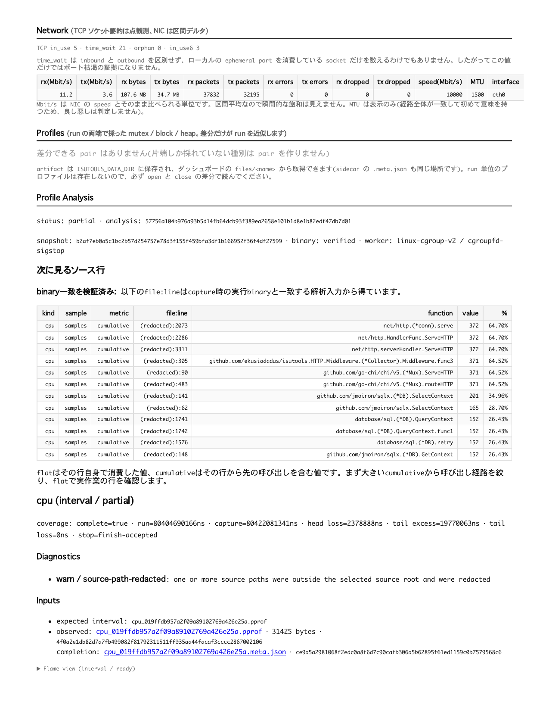
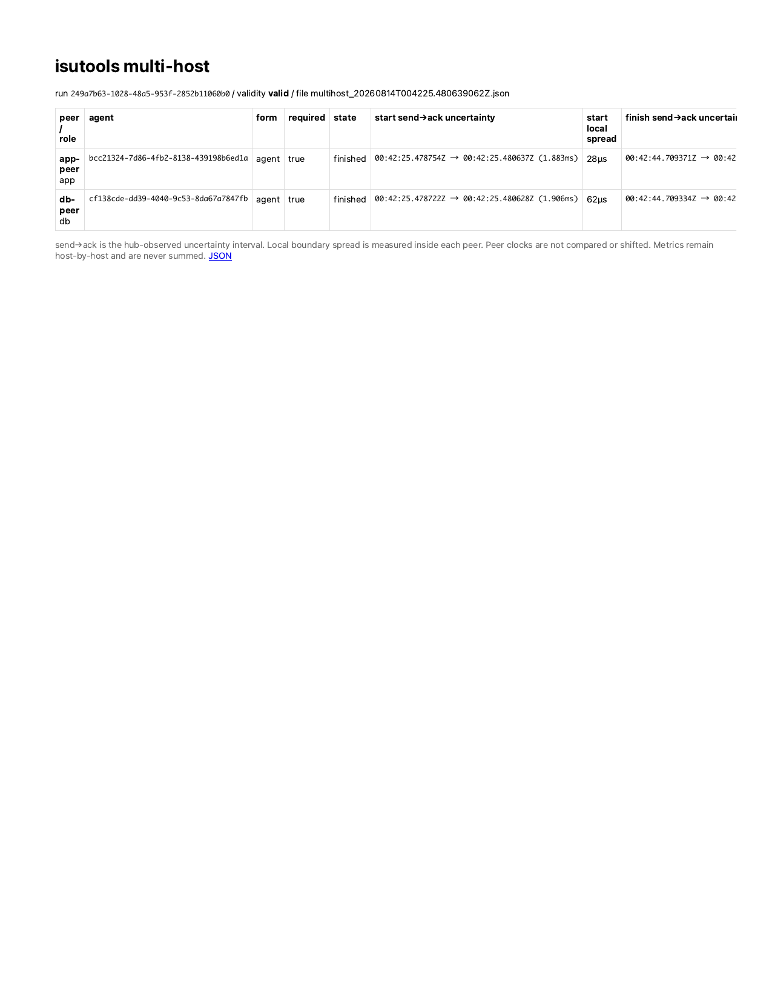

# isutools

[](https://pkg.go.dev/github.com/ekusiadadus/isutools)
[](https://github.com/ekusiadadus/isutools/actions/workflows/ci.yml)
[](./LICENSE)

[English](./README.en.md) | **日本語**

**ISUCONの計測・比較・振り返りを、1つのダッシュボードに。**

isutoolsはGoアプリへ最小限の変更で組み込める、ISUCON向けのオールインワン計測モジュールです。SQL、HTTP、nginx/Caddy/Apacheログ、pprof、プロセス、ホスト、ネットワーク、DBプールを同じベンチマーク区間で収集し、スコアとgit revision付きで保存します。


## まず試す

```go
import "github.com/ekusiadadus/isutools"

db, err = sqlx.Open(isutools.SQLDriverName("mysql"), dsn)
http.ListenAndServe(":8080", isutools.HTTP(handler))
```

管理画面は`127.0.0.1:19191`で起動します。SSH転送したうえで、ベンチマークごとに次を実行します。

```bash
curl -fsS -X POST http://127.0.0.1:19191/reset
# benchmark command
curl -fsS -X POST 'http://127.0.0.1:19191/save?score=12345'
```

公式の初期実装へ計測だけを追加する再現可能な例も用意しています。

- [private-isu 最小導入サンプル](./examples/private-isu/README.md)
- [ISUCON14 最小導入サンプル](./examples/isucon14/README.md)

どちらもSQLドライバーとHTTPハンドラーの計測、`reset -> benchmark -> save`だけを追加し、
インデックス、キャッシュ、マッチングなどのチューニングは含みません。

### 別PCからprivate-isuを操作するMakefile

このrepositoryの`Makefile`は、既存のremote private-isuに対するreadiness確認、実ベンチ、
artifactのSCP取得、SSH port forwarding、手動CPU profile取得をまとめます。最初に
`.isutools.mk.example`をlocal設定`.isutools.mk`へコピーし、既存環境のhost/pathだけを
指定します。`.isutools.mk`はgitignoreされます。

```bash
cp .isutools.mk.example .isutools.mk
$EDITOR .isutools.mk

make status          # 既存containerを表示
make check           # app / MySQL / isutoolsのreadiness
make bench           # reset -> bench -> collect -> save -> SCP
make verify-results  # 手元の最新JSONを要約
make tunnel          # localhost:19191へSSH転送（Ctrl-Cで終了）
make pprof PPROF_SECONDS=30
```

結果は既定で`~/isutools-private-isu-results`へ保存されます。`make pprof`はmanual
`/pprof/profile`を使うため、managed run CPU modeがprofileを所有している間は409で停止します。
publicな`0.0.0.0:19191`へ迂回せず、SSH/Tunnel自体の障害は先に復旧してください。

2026-08-14にはWindows/WSL2上の既存private-isuへSSH接続し、マージ済みSHAで
`make check`と実際の`make bench`、durable snapshotのSCP取得、run境界CPU profileの
hard-isolated解析・flame表示、必須/任意peerを含むmulti-host hub、loopback SSH転送まで
再確認しました。score 0 / pass trueのため性能結果ではなく、操作・収集・保存経路の実機確認です。

- [2026-08-14: マージSHA、run ID、hash、保存形式、制約を含む最終確認](./docs/private-isu-field-verification-20260814.md)
- [2026-08-13: 初回SSH確認記録](./docs/private-isu-ssh-verification-20260813.md)





## 最初に分かること

- どのSQLとHTTPパスが時間を使っているか
- インデックスが効かず、何行を余計に読んでいるか
- CPU、メモリ、ディスク、ネットワークを使い切っているか
- DBではなくコネクションプールで待っていないか
- 変更前後でスコア、エラー、total、count、averageがどう変わったか
- 計測の欠損や汚染がなく、比較可能なrunだったか

## 実利用の記録

private-isuをisutoolsの計測だけで1日チューニングし、**score 0から541,650（fail 0）**まで改善しました。これは一般的な性能保証ではなく、同一環境でのdogfooding記録です。

- [改善手順と全記録](https://ekusiadadus.com/ja/blog/private-isu-500k-with-isutools)
- [ISUCON14 case study](./docs/case-studies/isucon14-20260805.md)
- [導入ガイド](./docs/INTEGRATION.md)
- [現場指摘 #19–#29 の設定・Echo・session・複数台運用](./docs/FIELD_FEEDBACK.md)
- [設計](./DESIGN.md) / [実装状況](./docs/IMPLEMENTATION_STATUS.md)

## 対応範囲

| 領域 | 対応 |
|---|---|
| Database | MySQL / MariaDB / PostgreSQL (`database/sql`) |
| HTTP | Go `net/http` middleware |
| Router adapters | Echo v4 / v5、framework-neutral route-template API |
| Reverse proxy logs | nginx / Caddy / Apache / Envoyの明示形式 |
| Runtime | pprof、CPU、mutex、block、heap |
| Host | Linux procfs / sysfs / cgroup v2 |
| Output | Live dashboard、JSON、自己完結HTML、run間diff |

詳細設定は利用前に[導入ガイド](./docs/INTEGRATION.md)を確認してください。管理画面はloopback bindとSSH転送を前提にし、外部公開しません。

## 実行前チェック(最初の5分)

以下を先に通すと、「ベンチは走ったが一部の数字だけ無い」を避けやすい。

### 1. 管理画面は loopback のまま SSH 転送する

```bash
ssh -L 19191:127.0.0.1:19191 isucon@example-host
```

ブラウザでは <http://127.0.0.1:19191/> を開く。`0.0.0.0` へ公開する必要はない。
アプリ側で `curl -fsS http://127.0.0.1:19191/ >/dev/null` が成功することも確認する。
この単純な転送はSSH daemonとisutoolsが同じnetwork namespaceにいる場合だけ成立する。
Windows SSH host→WSL2、VM、nested containerの場合は
[統合ガイド §8](./docs/INTEGRATION.md#8-管理ポートと権限)のguest relayとkeepalive手順を使う。

### 2. 計測境界は reset → benchmark → save

```bash
curl -fsS -X POST http://127.0.0.1:19191/reset
# benchmark command
curl -fsS -X POST 'http://127.0.0.1:19191/save?score=12345'
```

initialize handler へ組み込む場合は、DB 再構築後・レスポンス送信前に
`ResetNow` を呼ぶ。`/reset` と `ResetNow` を同じ run で重ねない。

### 3. EXPLAIN 用 MySQL ユーザーは3行を直接 GRANT する

`ISUTOOLS_EXPLAIN=1` を使う場合、対象 schema の `SELECT` だけでは不足する。
次の3権限を role 経由ではなく、専用ユーザーへ直接付与する(`isuride` は対象
schema 名に置き換える)。

```sql
GRANT SELECT ON `isuride`.* TO 'isutools_explain'@'127.0.0.1';
GRANT SELECT ON `performance_schema`.* TO 'isutools_explain'@'127.0.0.1';
GRANT UPDATE ON `performance_schema`.`threads` TO 'isutools_explain'@'127.0.0.1';
SHOW GRANTS FOR 'isutools_explain'@'127.0.0.1';
```

isutools は接続後に `SET ROLE NONE` で実効権限を検査するため、role だけの付与は
使えない。2行目が無いと権限検査、3行目が無いと EXPLAIN セッションの自己計装停止に
失敗する。パスワードは README や shell history に書かず、権限を絞った env file から
DSN へ渡す。詳しい安全性と許可リストは[統合ガイド §11](./docs/INTEGRATION.md#11-explain-取得計画09)。

### 4. nginx advisor には実際に読み込まれる設定を渡す

現在版は entrypoint の include graph を追うため、まず実際の entrypoint を指定する。

```bash
export ISUTOOLS_NGINX_CONF=/etc/nginx/nginx.conf
export ISUTOOLS_PROXY_CONF=/etc/nginx/nginx.conf
export ISUTOOLS_PROXY_KIND=nginx
```

古いリリース、複雑な include、symlink が混在する構成では、`nginx -T` で実効設定を
1ファイルに固定すると確実。設定変更後は必ず作り直してからアプリを再起動する。

```bash
sudo sh -c 'nginx -T 2>/dev/null > /etc/nginx/isutools-effective.conf'
sudo chmod 0644 /etc/nginx/isutools-effective.conf
export ISUTOOLS_NGINX_CONF=/etc/nginx/isutools-effective.conf
export ISUTOOLS_PROXY_CONF=/etc/nginx/isutools-effective.conf
```

`/etc/nginx` 全体を古い版へ渡すと `sites-available` と `sites-enabled` の symlink を
二重に読むことがある。一方、include を追わない版へ `nginx.conf` だけ渡すと vhost を
見落とす。実効設定スナップショットは両方を避ける互換手段である。

### 5. 動的 ID が行ごとに分裂していないか確認する

現在版は数値・UUID・ULID の path segment を自動正規化する。旧版で ULID route が
HTTP 表に1 ID ずつ出る場合は、リリース更新まで `ISUTOOLS_PATH_RULES` でまとめる。

```bash
export ISUTOOLS_PATH_RULES='^/api/app/rides/[0-7][0-9A-HJKMNP-TV-Z]{25}/evaluation$=/api/app/rides/*/evaluation;^/api/chair/rides/[0-7][0-9A-HJKMNP-TV-Z]{25}/status$=/api/chair/rides/*/status'
```

実機でこれらの確認項目が必要になった経緯と、score 9,511 の artifact から
matcher・notification polling の順に改善した判断は
[ISUCON14 case study](./docs/case-studies/isucon14-20260805.md)に一次記録として残している。

## Go API(任意の追加連携)

1行導入はそのまま。以下は **すべて opt-in** で、呼ばなければ従来どおり動く。

```go
// (1) initialize をベンチ区間の開始にする
func postInitialize(w http.ResponseWriter, r *http.Request) {
	err := isutools.SerializeInitialize(r.Context(), func(ctx context.Context) error {
		if err := rebuildDB(ctx); err != nil {
			return err
		}
		// ★ initialize レスポンスを書く「前」に呼ぶ。
		//    ベンチはレスポンスを見た瞬間に負荷を開始するので、
		//    後で呼ぶと run の冒頭が丸ごと欠ける。
		run, err := isutools.ResetNow(ctx)
		if err != nil || run.Validity == isutools.ValidityInvalid {
			return fmt.Errorf("isutools: this run is not measurable: %w", err)
		}
		return nil
	})
	if err != nil {
		// 計測が必須なら handler ごと失敗させる。
		// 汚染された run を「それらしい数値」として残すほうが有害。
		http.Error(w, "initialize failed", http.StatusInternalServerError)
		return
	}
	writeInitializeResponse(w) // レスポンスはここで初めて書く
}

// (2) DB を安定 ID で登録し、プールと EXPLAIN 用 credential を紐付ける
//     Purpose は "github.com/ekusiadadus/isutools/sqlstats" にある
isutools.RegisterDBTarget("app", "mysql", dsn) // sqlx.Open より前に呼ぶ
db, _ := sqlx.Open(isutools.SQLDriverName("mysql"), dsn)
isutools.WatchDBPool("app", db.DB)             // 反映は「次の run」から
isutools.RegisterDBInspector("app", sqlstats.PurposeExplain, "mysql", explainDSN)
```

| 関数 | シグネチャと要点 |
|---|---|
| `ResetNow` | `func ResetNow(ctx context.Context) (StartResult, error)`。実行中の run を preempt して即座に新しい run を開く(最後の initialize が必ず勝つ)。`ISUTOOLS=off` ならゼロ値と `nil` を返すので分岐不要 |
| `ResetNowWithNonce` | `func ResetNowWithNonce(ctx context.Context, nonce string) (StartResult, error)`。同じ nonce の再送は最初の `StartResult` を replay する(initialize リトライ対策) |
| `SerializeInitialize` | `func SerializeInitialize(ctx context.Context, fn func(context.Context) error) error`。initialize 全体(スキーマ再構築 + `ResetNow`)を包む。**プロセス内**の直列化のみ。取得できなければ `ErrInitializeBusy`(既定 30 秒)。`ISUTOOLS=off` でも直列化は効く |
| `RegisterDBTarget` | `func RegisterDBTarget(id, driverName, dsn string) error`。論理 DB に人間が読める安定 ID を付ける。**Open より前**に呼ぶこと(先に接続すると DSN から自動導出された `名前-ハッシュ` 形式の ID で登録され、明示 ID の登録は `ErrDuplicateTarget` で失敗する) |
| `RegisterDBInspector` | `func RegisterDBInspector(targetID string, purpose sqlstats.Purpose, driverName, dsn string) error`。既存 target に 2 本目の credential を付ける。`PurposeStats`(SHOW STATUS / performance_schema)と `PurposeExplain`(EXPLAIN 専用・最小権限)のみ。`PurposeExplain` はアプリ credential へ **fallback しない**。DSN は go-sql-driver/mysql 形式のみ |
| `WatchDBPool` / `UnwatchDBPool` | `func WatchDBPool(targetID string, db *sql.DB) error`。登録済み TargetID(byte 一致)のプールだけを見る。ID を作ることはしない — 未登録なら `ErrUnknownTarget`、`db` が nil なら `ErrNilDB`。ID は `RegisterDBTarget` か `sqlstats.TargetIDForDSN` から得る。引数検査は `ISUTOOLS=off` / `ISUTOOLS_DBPOOL=off` でも実行されるので、配線ミスはベンチ時ではなく本番構成で気付ける |

`ResetNow` 系はいずれも「境界を確定するだけ」であり、2 回目の initialize が
DB を作り直すこと自体は止められない。だから `SerializeInitialize` で包む。
包まずに開いた initialize run は health に `initialize-unserialized`(degraded)
として残る。

なお `ResetNowOpts` も exported だが、引数の型が `internal/runctl` にあり
**アプリからは import できないので実際には呼べない**(戻り値の `StartResult` /
`Validity` は型エイリアスがあるので読める)。initialize から使うのは
`ResetNow` と `ResetNowWithNonce` の2つだけでよい。

## エンドポイント(管理サーバ)

| ルート | 内容 |
|---|---|
| `GET /` | **実行一覧**(日時 JST・gen・rev・score)。行クリックで詳細へ |
| `GET /<run-id>` | 保存済み実行の詳細(旧秒精度 ID と衝突防止付き高精度 ID) |
| `GET /live` | 現在計測中のライブレポート(合計時間降順ソート済み) |
| `GET /snapshot.html` | 自己完結 HTML をダウンロード(手元でダブルクリック閲覧) |
| `GET /json` | 機械可読スナップショット(`prev` = 前世代付き) |
| `GET /pprof/` | net/http/pprof(アプリプロセスのプロファイル) |
| `GET /diff?a=<id>&b=<id>` | **2つの実行の差分**(total/count/avg。件数差がある行は改善と断定しない) |
| `POST /reset` | 世代リセット + run 開始(ベンチ前に叩く)。CPU プロファイル自動採取も開始 |
| `POST /collect` | buffered nginx log を期限付きで flush 待ち・回収 |
| `POST /finish` | 現 run の終了境界を固定し、drain を待たず `202` + 境界 JSON を返す |
| `POST /abort` | 現 run を epoch fence 付きで中止(`204`、冪等、snapshot は作らない) |
| `POST /save?score=N&pass=true|false` | 終了境界を固定して immutable snapshot を待ち、上限付きで html+json staging 保存。`pass` は任意のベンチマーカー判定(HTML は JSON 公開後に一覧へ出る) |
| `GET /files/<name>` | 保存済み html / json / pprof の取得 |

`/reset` `/finish` `/abort` `/save` は開始・終了した run の ID を
`X-Isutools-Run-Id` ヘッダで返す(ベンチスクリプトのログに残すと、
どの run がどのベンチだったかを後から突き合わせられる)。

## レポートに出るもの

- **meta**: 時刻(**常に JST**)・git rev(+dirty)・build source / provenance 判定・世代番号・score・
  **ホスト情報(CPU モデル / コア数 / メモリ GB / OS)**
- **Bottleneck Overview**: HTTP / SQL の累計 demand、5xx / 499、CPU 区間の
  信頼性と飽和度、DB pool wait、SQL 行効率、Host I/O を「最初に見る順」で要約。
- **Run Timeline** (`ISUTOOLS_TIMELINE=1`): 1秒 bucket の HTTP/SQL/resource
  推移、phase shift、低流量 critical-path 候補、bottleneck migration。全候補は
  `correlation-suspect` で、window・metric・formula・limitation を併記する。
  原因を自動断定せず、各詳細セクションへ降りるための triage として表示
- **Collector Health**: 各コレクターの状態・欠損(`partial`)警告
- **DB Schema**: 世代開始時点のテーブル・行数・**インデックス一覧**(「実行前に何が
  貼ってあったか」の証跡)
- **SQL**: 正規化クエリ別 total/count/errors/avg/p95/max(文字列・数値リテラルは `?` にマスク)
- **SQL 行効率**: digest 別 rows examined / rows sent。「1 行返すために何行読んだか」
  = インデックスが効いているかの実測(MySQL の performance_schema が必要)
- **Query Plans**: 上位 digest の EXPLAIN 結果。「なぜその行効率なのか」を
  type=ALL / Using filesort / Using temporary で示す(既定 off)
- **DB Pool**: `database/sql` のプール統計。「DB が遅いのか、プール上限の
  行列で待っているだけなのか」を waits と平均 wait で切り分ける
- **Host**: メモリ / ディスク IO / PSI / cgroup 上限と host identity。
  「マシン側に資源が残っていたのか」(Linux のみ)
- **Network**: TCP ソケット要約と NIC のスループット・エラー・drop・MTU。
  「NIC を使い切ったのか、それとも余っていたのか」(Linux のみ)
- **Profiles**: run の両端で採った mutex / block / heap のペアと、その
  `go tool pprof -diff_base` 差分コマンド(既定 off)
- **HTTP**: アプリ視点のリクエスト別レイテンシ・バイト数
- **Proxy Access Log**: nginx/Caddy/明示JSON(reqtime/upstime 分離・bytes・cache・304 等)
- **Processes**: ベンチ区間のプロセス別 CPU/RSS(top 互換 1core=100%)+
  **CPU total: N% busy(user/sys/iowait/idle)** — ハードを使い切れているかが一目で分かる
- **User Flow**: セッション毎のページ遷移 上位20(proxy ログの `sess:` フィールドから。
  「ユーザーがどうアプリを使っているか」の実測。k6 シナリオの検証にも)
- **Scenario Stories**: 安全な`scenario`ラベル + 疑似`sess`ごとのrequest列を、
  シナリオ別の上位ユーザーストーリーとして集計(GA4風flowの最小基盤)
- **Counters**: `isutools.Count("cache_hit")` によるアプリ内カウンタ(世代毎リセット)
- **Advisor**: ISUCON 定石で未設定のものに加え、HTTP/3/QUIC移行readiness
  (server/TLS/Alt-Svc/fallback/UDP/edge/実測protocol/再送・drop evidence)、
  キャッシュ戦略(`nginx-proxy-cache` / `nginx-proxy-cache-lock` /
  `nginx-proxy-cache-set-cookie` / `cache-app-telemetry`)、ECH readiness
  (`ech-config` / `ech-key-rotation` / `ech-logging`)、
  同一ホスト upstream の UNIX domain socket 化(`nginx-upstream-uds`)、
  listen backlog と `somaxconn` の突き合わせ(`nginx-listen-backlog`)、
  Go PGO ビルドの有無(`go-pgo`)、実行計画由来の
  `plan-full-scan` / `plan-filesort` / `plan-temporary`。
  v1.2 の3件(`nginx-upstream-uds` / `nginx-listen-backlog` / `go-pgo`)は
  「不具合」ではなく「伸びしろ」なので ok / info / skip しか出さず warn には**しない**。
  `plan-*` の3件だけは実測の実行計画が根拠なので warn を出す
- **Snapshots / CPU Profiles**: 過去実行・プロファイルの一覧(ダッシュボードから選択、
  各行に前回実行との diff リンク)

## 環境変数

| 変数 | 既定 | 意味 |
|---|---|---|
| `ISUTOOLS` | (on) | `off` で全機能無効(素の driver 名を返す。query path 追加処理ゼロ) |
| `ISUTOOLS_ADDR` | `127.0.0.1:19191` | 管理サーバ bind。`off` で管理サーバのみ無効(SQL 集計は継続) |
| `ISUTOOLS_ALLOW_UNAUTHENTICATED` | — | `1` で非 loopback bind を明示許可。**SSH トンネル + `127.0.0.1` 限定 publish の Docker 構成専用**(security warningを表示。計測の`partial`とは分離) |
| `ISUTOOLS_DATA_DIR` | — | スナップショット / プロファイルの永続化先(実行一覧の実体) |
| `ISUTOOLS_ACCESS_LOG` | — | nginx/Caddy/Apache/Envoy ログのパス。**LTSV / JSON 行を自動判別**(対応形式は統合ガイド参照) |
| `ISUTOOLS_ACCESS_LOG_PATH_RULES` / `_UNMATCHED` | — / `keep` | access logのfull-match regexp→定数path。未一致は`keep`または`collapse` |
| `ISUTOOLS_SQL_COMMENT_TAGS` | on | 安全な先頭tag 1個だけ保持。`off`なら`/* ... */`を含む全commentをtag化せず集計前に除去 |
| `ISUTOOLS_NGINX_LOG` | — | 旧変数名。`ACCESS_LOG` 未設定時だけ fallback |
| `ISUTOOLS_PPROF_SECONDS` | 0 | fixed modeではreset後の採取秒数、run modeではhard max秒数(1〜600) |
| `ISUTOOLS_CPU_PROFILE_MODE` | off | `fixed`で従来のtimer採取、`run`でrun境界連動CPU採取。`run`中のmanual `/pprof/profile`は409 |
| `ISUTOOLS_PROFILE_ANALYSIS` | off | `1`でread-only capabilities、CAS publish、derived analysis表示を有効化 |
| `ISUTOOLS_PEER` / `_TOKEN` | off / — | embedded peerを明示的に有効化。tokenは32 byte以上、listenerはliteral loopbackのみ |
| `ISUTOOLS_SESSION_COOKIE` / `_HMAC_KEY` | — | trusted session adapterのsource cookieと32 byte以上のHMAC key |
| `ISUTOOLS_PPROF_LABELS` | off | `1`でCPU profileへcapture/tupleのopaque private labelを付与。raw URLは保存しない |
| `ISUTOOLS_PPROF_SAFE_ROUTE_RULES` | — | router patternが無いroute用のfull-match regexp→定数label。invalid時はrules全体を無効化 |
| `ISUTOOLS_GIT_HASH` / `_DIRTY` | — | Docker ビルドで vcs 情報が埋まらない場合の rev 注入 |
| `ISUTOOLS_PATH_RULES` | — | HTTP パス正規化ルール(`regex=replacement;...` 各ペアは最後の `=` で分割) |
| `ISUTOOLS_TIMELINE` | off | `1` / `on` / `true` / `yes` でrun-aligned時系列解析を有効化。既定offなので通常のrequest pathには追加observerなし |
| `ISUTOOLS_TIMELINE_INTERVAL` | `1s` | bucket幅。`100ms`〜`1m` |
| `ISUTOOLS_TIMELINE_BUCKETS` | `180` | runごとのbucket上限。2〜600。超過区間は最後のbucketへ集約し`truncated`を明示 |
| `ISUTOOLS_TIMELINE_MAX_OPERATIONS` | `32` | HTTP/SQLそれぞれのrun全体operation key上限。1〜128、超過は`(other)` |
| `ISUTOOLS_TIMELINE_SAFE_ROUTE_RULES` | — | router patternが無いroute用のfull-match regexp→定数label。capture展開不可。未一致は`(unmatched)` |
| `ISUTOOLS_NGINX_CONF` | — | advisor が検査する nginx conf(ファイル or ディレクトリ) |
| `ISUTOOLS_PROXY_CONF` / `_KIND` | — / auto | HTTP/3 advisor が読む nginx/Caddy/Envoy 設定。nginx entrypoint file は include graph を追跡し、directory は `*.conf` を symlink 重複排除して読む。kind は `nginx` / `caddy` / `envoy` |
| `ISUTOOLS_HTTP3_UDP443` | — | 外部clientからの結果を `reachable` / `blocked` で明示。プロセス内からfirewall/NATを推測しない |
| `ISUTOOLS_HTTP3_EDGE` / `_EDGE_ENABLED` | — | LB/CDN名と、そのedgeでのHTTP/3有効状態(`true` / `false`)の明示evidence |
| `ISUTOOLS_HTTP3_QUIC_METRICS` | — | snapshot時に再読込するproxy QUIC counter JSON。再送率とUDP dropを診断 |
| `ISUTOOLS_CACHE_METRICS` | — | snapshot時に再読込するアプリ側キャッシュ counter JSON(`hits` / `misses` / `evictions`)。ヒット率とexpire前evictionを診断 |

### コレクター有効/無効(すべて既定 on)

`off` を入れるとそのコレクターは **登録自体されない**(1文も発行せず、
phase 予算も消費しない)。ABBA で「その計測だけ外した run」を作るための
スイッチであり、機能を止めるためのものではない。

無効と解釈される値は `off` / `0` / `false` / `no` / `disabled`(前後の空白と
大文字小文字は無視)。それ以外の値はすべて on 扱いになる。**`ISUTOOLS_HOSTSTATS`
だけは `disabled` を受け付けない**(`off` / `0` / `false` / `no` のみ)ので、
`ISUTOOLS_HOSTSTATS=disabled` は無効化にならず on のままになる。

| 変数 | 既定 | 意味 |
|---|---|---|
| `ISUTOOLS_HOSTSTATS` | on | Host セクション(メモリ / disk / PSI / cgroup / identity)。Linux 以外、および `/proc/meminfo` が読めない環境では `ErrUnsupportedOS` を返して自動的に未登録 |
| `ISUTOOLS_NETSTATS` | on | Network セクション(collector 名は `network`)。Linux 以外では `/proc/net` が無いため未登録 |
| `ISUTOOLS_SQLROWS` | on | SQL 行効率セクション。performance_schema が有効な MySQL でのみ数値が出る |
| `ISUTOOLS_DBPOOL` | on | DB Pool セクション。`WatchDBPool` を1つも呼んでいなければセクションは出ない |

### ランタイムプロファイル(すべて既定 off)

run の両端で採り、差分だけを読む。プロファイルレートはプロセス全体の
runtime 設定なので、**未設定の変数には一切触らない**(アプリが自分で
設定した値を勝手に上書きしない)。

| 変数 | 既定 | 意味 |
|---|---|---|
| `ISUTOOLS_MUTEX_FRACTION` | (未設定=変更しない) | `runtime.SetMutexProfileFraction` に渡す 0 以上の整数。実効値が 0 より大きいときだけ mutex profile を採る |
| `ISUTOOLS_BLOCK_RATE_NS` | (未設定=変更しない) | `runtime.SetBlockProfileRate` に渡す 0 以上の整数(ナノ秒)。この変数で 1 以上を設定したときだけ block profile を採る |
| `ISUTOOLS_HEAP_PROFILE` | off | `1` / `true` / `on` / `yes` で heap profile を採る |

数値として解釈できない値は **無視して fail-open** し、health の `profile` に
`ignored invalid values: ...` として残る。成果物は `ISUTOOLS_DATA_DIR` に置かれ、
ダッシュボードの Profiles セクションに `go tool pprof -diff_base` のコマンドが出る。

`ISUTOOLS_CPU_PROFILE_MODE=fixed`は従来どおりreset後のtimerだけで停止し、finish/abortでは
止めない。Handlerと`ResetNow`は同じprocess-wide ownerを使い、成功したprofileは0600の
immutable `.pprof`とSHA-256付き`.meta.json`を一組で保存・retentionする。manual
`/pprof/profile`はfixed/offでは引き続き利用でき、409になるのはmanaged run modeだけである。

run境界CPU採取と外部解析はv1.4.0のopt-in機能である。Linux cgroup v2上の
hard-limit/OOMと実`runtime/pprof` CPU profileは検証済みだが、Darwin crash faultと
完全なprivate-isu ABBA gateは未検証範囲として残る。`ISUTOOLS_CPU_PROFILE_MODE=run`と
`ISUTOOLS_PROFILE_ANALYSIS=1`を設定し、ABBA block終了後にcontrol host上の
`isutools-pprof preflight / fetch / analyze / publish`を順に使う。`fetch`は`/save`が返した
exact `snapshot_base`と`snapshot_sha256`を必須とし、`publish`はoperatorが確認した
`--expected-current`を必須とする。409を自動retryしない。hard memory primitiveを確立できない
環境ではprofile bytesを読む前にexit 4となり、soft limitへdowngradeしない。詳細は
[統合ガイド §7](./docs/INTEGRATION.md#7-pprofprocstats負荷生成ツール)を参照。

短時間のinitialize/resetでもCPU profiler ownershipはbounded handoffされる。100ms以内に
前ownerが解放されなければ新runへ`skipped/cpu-busy`を明示し、無言の欠落や二重Startは起こさない。
initialize retryには引き続き同じnonceの`ResetNowWithNonce`を使う。

### EXPLAIN(既定 off)

| 変数 | 既定 | 意味 |
|---|---|---|
| `ISUTOOLS_EXPLAIN` | off | `1` / `on` / `true` / `yes` / `enabled` で EXPLAIN 取得を有効化。それ以外は off(計測対象 DB に文を追加するので opt-in) |
| `ISUTOOLS_EXPLAIN_TOP` | 10 | 1 target あたり EXPLAIN する SELECT digest の上限。解釈不能・0 以下は 10 に戻し、200 を超える値は 200 に丸める |
| `ISUTOOLS_EXPLAIN_DSN` | — | EXPLAIN 専用 credential の DSN(go-sql-driver/mysql 形式)。**登録済み target がちょうど1つのときだけ**有効で、2つ以上なら「どちらの DB か」が決まらないため拒否し health に残す。その場合は `RegisterDBInspector(id, PurposeExplain, ...)` を使う |
| `ISUTOOLS_EXPLAIN_DRIVER` | `mysql` | 上の DSN を open するドライバ名 |

### ホスト計測の補助

| 変数 | 既定 | 意味 |
|---|---|---|
| `ISUTOOLS_ROLE` | — | この agent の役割ラベル(`app` / `db` / `proxy` など)。自由記述で、表示にのみ使う |
| `ISUTOOLS_CGROUP_SCOPE` | (自動判定) | `host` を入れたときだけ「initial cgroup namespace に居る」という宣言になる。コンテナ内からは自己判定できないので推測しない。既定は見えている cgroup ツリーに応じて `visible-root` / `agent-cgroup` |
| `ISUTOOLS_CGROUP_PATH` | — | 読む cgroup を cgroup2 マウント相対で指定(agent と mysqld が別 cgroup のとき用)。絶対パス・`..`・マウント外へのシンボリックリンク・読めないパスは **fail closed** で cgroup 計測ごと skip し、理由コードを health に残す |

## 追加ライブラリと事前準備

pprof 採取は Go 標準ライブラリなので、計測対象アプリ側の追加 package は不要。外部
`isutools-pprof`だけが固定versionの`github.com/google/pprof/profile`を使う。自動 CPU profileには
writable な `ISUTOOLS_DATA_DIR`が必要で、手動表示には引き続き`go tool pprof`も使える。procstats も
追加 package はないが Linux `/proc` と PID namespace の権限が必要。k6、curl、jq、
Graphviz は用途別の外部コマンドであり、isutools の runtime library ではない。
機能別の必須／任意一覧は [統合ガイド §1](./docs/INTEGRATION.md#1-必須任意の全体像)。

## SQL 行効率(examined/sent)

`performance_schema.events_statements_summary_by_digest` を run の両端で読み、
その差分から digest ごとの **rows examined / rows sent** を出す。
「1 行返すために何行読んだか」であり、**ISUCON13 優勝チームが実際に使った基準は
「5 倍以下」**。ダッシュボードは比 > 5 の行、および no index / tmp disk table /
sort merge が発生した行を網掛けにする。

比は **SELECT かつ sent > 0 の digest でのみ**算出し、**DML と rows_sent=0 は
`N/A`** と表示する(0 で割るか、単に「該当行が無かった」だけのクエリに最悪スコアを
でっち上げるかのどちらかになるため)。DML の行は代わりに affected 列を見る。

前提と制約:

- MySQL の **performance_schema が有効**であること。無効な target は数値を出さず
  skip 理由だけを出す(「測るものが無い」ことは失敗として扱わない)。sqlrows は必須
  コレクターではないので、実際に失敗した場合も run は partial に落ちるだけで無効にはならない。
- 計測用接続は既定 DB を持たない状態で張られ、自分の文が計測結果に混ざらないことを
  `performance_schema.threads` で**検証**する。検証できない target は
  「混ざった数値」を出すより skip を選ぶ。
- `performance_schema_digests_size` が不足していると overflow 行が出る。
  その target の集計は全数ではない旨が警告として表示される。

## Query Plans(EXPLAIN・既定 off)

`ISUTOOLS_EXPLAIN=1` のときだけ、ベンチ終了後の enrich フェーズで
**1 run につき 1 回**、上位 digest に EXPLAIN を実行する。ダッシュボードを
開いても再実行はしない。結果は type=ALL / Using filesort / Using temporary を
網掛けし、advisor の `plan-full-scan` / `plan-filesort` / `plan-temporary` に繋がる。

- 文面は MySQL の `QUERY_SAMPLE_TEXT` を使うため **MySQL 8.0.17 以降のみ**。
  それ未満と MariaDB には列が無く、`explain-unsupported` として skip する。
- **EXPLAIN 専用の最小権限ユーザーが必須**(`PurposeExplain`)。アプリの credential に
  fallback することは決してしない — EXPLAIN SELECT はストアド関数経由で副作用を持ち得るため。
  権限は接続そのもの上で role を無効化して検証し、許可リスト(対象 schema と
  performance_schema への SELECT ほか)を超えていれば skip する。
- リテラルを含む文面はサンプルを読んだコールバックの外に出さない。スナップショットに
  残るのは正規化済みの DIGEST_TEXT と、失敗時は分類コード + ドライバの数値コードだけ。

## Host / Network / DB Pool

- **Host**(`hoststats`)と **Network**(`netstats`)は procfs / sysfs / cgroup v2 を
  読むため **Linux でのみ登録される**。他 OS では collector health に disabled と出る。
- Host はどの cgroup を見たか(scope)と host identity(hostname、machine-id /
  boot-id のハッシュ、各 namespace)を必ず併記する。コンテナ内では同じファイルが
  マシンではなく namespace を説明するので、scope の無い数値は読めない。
- Network の値は**表示専用**で、advisor の閾値には一切繋げていない。区間平均は
  瞬間的な飽和を見られず、`/proc/net/sockstat` の TIME_WAIT は inbound と outbound を
  区別しないため。
- DB Pool も現時点では数値のみで閾値判定はしない。`wait 合計` は待った goroutine
  全員の待ち時間の総和なので run の長さを超え得る。比較には **平均 wait**
  (wait_duration ÷ waits)を使う。waits が 0 でなければ、その待ち時間を決めたのは
  DB ではなくプール上限。

## nginx 設定(アクセスログ計測)

[examples/nginx-isutools.conf](./examples/nginx-isutools.conf) の LTSV 形式を推奨。
URI グルーピングは nginx の `map` で行い、集計キーを `uri:$uri_group`、生パスを
`rawuri:$uri` として両方残す方式が便利(パーサは未知キーを無視する)。
JSON 形式(`log_format ... escape=json '{...}'`)も同じキー名、または
**alp のデフォルトキー(`body_bytes` / `response_time`)**でそのまま読める。
JSON は必須ではなく、行頭 `{` なら JSON、それ以外は LTSV と自動判定する。
標準 combined log は推測しない。Apache は明示 JSON と `%D` の microseconds 変換が
必要になるため、設定例・権限・Docker volume・安全な `sess` の作り方を
[統合ガイド §4–5](./docs/INTEGRATION.md#4-nginx-アクセスログ)にまとめた。

## HTTP/3 / QUIC 移行Advisor

Advisorはnginx/Caddy/Envoy設定、LinuxのローカルUDP/443 listener、proxyアクセスログの
`proto`別件数・5xx・p95を検査する。reverse proxy終端時はアプリの`r.Proto`が
client protocolを表さないため、`ISUTOOLS_ACCESS_LOG`のclient-facing protocolを優先する。
ただし外部LB/CDN終端ではorigin logもclient-facingではないため、edge analyticsまたは
外部client実測が必要になる。
LB/CDN、外部firewall/NAT、QUIC再送counterは自動推測せず、明示evidenceがない場合は
`skip`になる。設定例、判定限界、Caddy native JSON、Envoy telemetryは
[統合ガイド §6](./docs/INTEGRATION.md#6-http3--quic-readiness-advisor)を参照。

この機能は移行可否の診断であり、isutools自身がHTTP/3 serverになる機能ではない。
`quic-go`等のruntime依存は追加されず、実listenerと外部clientでの接続試験は別途必要。

## ベンチスクリプトの型

```bash
ADMIN=http://localhost:19191
curl -X POST $ADMIN/reset                  # 世代開始(CPU プロファイル自動開始)
<ベンチ実行>
curl -X POST "$ADMIN/save?score=$score"    # 永続化 → ダッシュボード一覧に1行追加
curl $ADMIN/json | jq '.sql[:5]'           # その場で top5 確認
```

保存せずに終了境界だけを即時固定する場合は `POST /finish`、計測を破棄して次の
run を開始可能にする場合は `POST /abort` を使う。`POST /collect` は access log の
flush だけであり run を終了しない。

## スクリーンショット

**Advisor** — 「ISUCON の定石なのに未設定」を自動検出(プリペアドステートメント・
gzip・buffer pool・カーネルパラメータ・GOMAXPROCS)。直すと ok に変わるチェックリスト:


**diff ビュー** — 2つの実行間でクエリ/パス毎の合計時間の増減を表示。
「改善したのか、ボトルネックが移動しただけか」が一目で分かる:


## セキュリティモデル(要約)

閲覧経路は **SSH トンネル前提**で、application-level token 機構は持たない。
loopback bind はそのまま利用でき、非 loopback は `ALLOW_UNAUTHENTICATED=1` を
明示し、Docker publish・firewall・SSHで到達性を制限した場合だけ許可する。
opt-inなしの非 loopback は fail closed。完全な契約と根拠は DESIGN.md 4章。
`isutools.Handler()` を自前 router に mount する場合のアクセス制御は呼び出し側の責任。

## シナリオ負荷試験(k6)との連携

負荷生成は [k6](https://k6.io) をそのまま使う(再実装しない)。
[examples/k6-private-isu.js](./examples/k6-private-isu.js) にログイン →
タイムライン → 投稿詳細 → 作者ページのシナリオ例がある。`POST /reset` →
k6 実行 → `POST /save` で、サーバ側から見たシナリオの SQL/HTTP/User Flow が
ダッシュボードに揃う。
同梱例は raw Cookie ではなく `X-Isutools-Session: k6-vu-N-iter-M` を送り、nginx 例が
その非秘密 ID だけを`sess:`に記録する。さらに
`X-Isutools-Scenario: login_and_browse`を`scenario:`へ記録すると、同じrequest列を
たどった疑似session数と上位journeyがScenario Storiesへ表示される。生Cookie、Bearer token、
email等を`sess`/`scenario`へ入れてはいけない。これらは偽装可能な計測ラベルであり、
認証・認可には使用しない。実ユーザー計測では外部headerを削除し、trusted app/proxyで
疑似IDを上書きする。詳細は
[統合ガイド §4](./docs/INTEGRATION.md#scenario-stories最小のファネルフロー基盤)。

## オーバーヘッド検証(ABBA)

[examples/abba.sh](./examples/abba.sh) が off→on→on→off の4連ベンチで
構成するブロックを最低3回実行する。同一 binary/image fingerprint、固定 warm-up、
score・p95・error rate、paired 95% CI を TSV と provenance に保存し、CI 上限で判定する。
必要な BENCH 出力形式はスクリプト先頭と[統合ガイド §7](./docs/INTEGRATION.md#7-pprofprocstats負荷生成ツール)を参照。

**v1.2.0 ではこのゲートは未通過(pending)**。[実装状況](./docs/IMPLEMENTATION_STATUS.md)に
記録された private-isu 上の観測は 2 ブロック(8 run)で off 平均 556,196 /
on 平均 546,150 = **+1.81% のスコア低下**であり、v1.0.0 の −0.58% より明確に重い。
しかも `abba.sh` は信頼区間を作るために最低 3 ブロックを要求して 2 ブロックでは
exit 2 する(`ABBA_BLOCKS must be >= 3 for a confidence interval`)ため、
この +1.81% は区間の付かない点推定にすぎない。コレクターが4本増えた以上
当然の増加ではあるが、DESIGN.md §7 の 2% 上限にほとんど余裕がない。

## v1.2 対応状況

実装済み: **run ライフサイクル**(`internal/runctl` の Start / Finish / Abort / Ack、
epoch fencing、phase 別の時間予算)/ **DB target registry**(安定 TargetID と
Purpose `app` / `stats` / `explain`、`RegisterDBTarget` / `RegisterDBInspector` /
`Inspect` / `Targets` / `TargetIDForDSN`)/ **SQL 行効率**(performance_schema の
examined vs sent)/ **hoststats**(メモリ / disk / PSI / cgroup / host identity・Linux のみ)/
**netstats**(TCP 要約 / NIC スループット / MTU・collector 名 `network`・Linux のみ)/
**dbpool**(`WatchDBPool` による `database/sql` プール統計)/
**queryplan**(`QUERY_SAMPLE_TEXT` 経由の EXPLAIN 取得・MySQL 8.0.17 以降・既定 off)/
**advisor 追加チェック**(`nginx-upstream-uds` / `nginx-listen-backlog` / `go-pgo` /
`plan-full-scan` / `plan-filesort` / `plan-temporary`)/
**ダッシュボードの新セクション**(SQL 行効率・Host・Network・DB Pool・Query Plans・Profiles)/
**Go API**(`ResetNow` / `ResetNowWithNonce` / `SerializeInitialize`、run 両端の
ランタイムプロファイルペア)。

v1.2時点では複数台横断計測は計画のみでしたが、現在のtreeにはembedded peer、
standalone agent、loopback hub、start/finish barrier、lease、snapshot budget、
ACK/abort sealがあります。host間transportはSSH local forwardingのみで、各hostの値は
合算せずparticipant別に保存します。設定と回復手順は
[現場指摘の実装ガイド](./docs/FIELD_FEEDBACK.md#multi-host-over-ssh-only-tunnels)を参照してください。
`SerializeInitialize` 自体の直列化範囲は引き続きプロセス内です。

その他の既知の制約: hoststats / netstats は Linux 専用、SQL 行効率は MySQL の
performance_schema が必要、EXPLAIN は MySQL 8.0.17 以降 + 専用の最小権限 credential が必要で
既定 off。ランタイムプロファイル(mutex / block / heap)も既定 off。

## v1.0 対応状況

実装済み: SQL(MySQL/MariaDB/PostgreSQL)/ HTTP(h1/h2)/ nginx ログ
(LTSV+JSON, ローテ追随)/ procstats + **CPU total** / dbinspect(MySQL)/
pprof(エンドポイント + 自動採取)/ snapshot-first ダッシュボード(実行一覧・
日時 ID 詳細・ライブ)/ JST 固定 / スコア記録 / collector health / 世代管理。

v1.0 のパス正規化、差分、counter、WebSocket/SSE 分離、User Flow、資源上限は実装済み。
Apache combined の推測 parser、gqlgen operation adapter、HTTP/3 実listener統合テストは
1.x 以降の明示的な非対応項目。現在のローカル検証範囲と、release tag 後に追加された
証跡を含む正確な状態は [実装状況](./docs/IMPLEMENTATION_STATUS.md)を参照。

---

「ISUCON」は、さくらインターネット株式会社の商標または登録商標です。本プロジェクトは [isucon.net](https://isucon.net/) の運営とは無関係の非公式ツールです。
