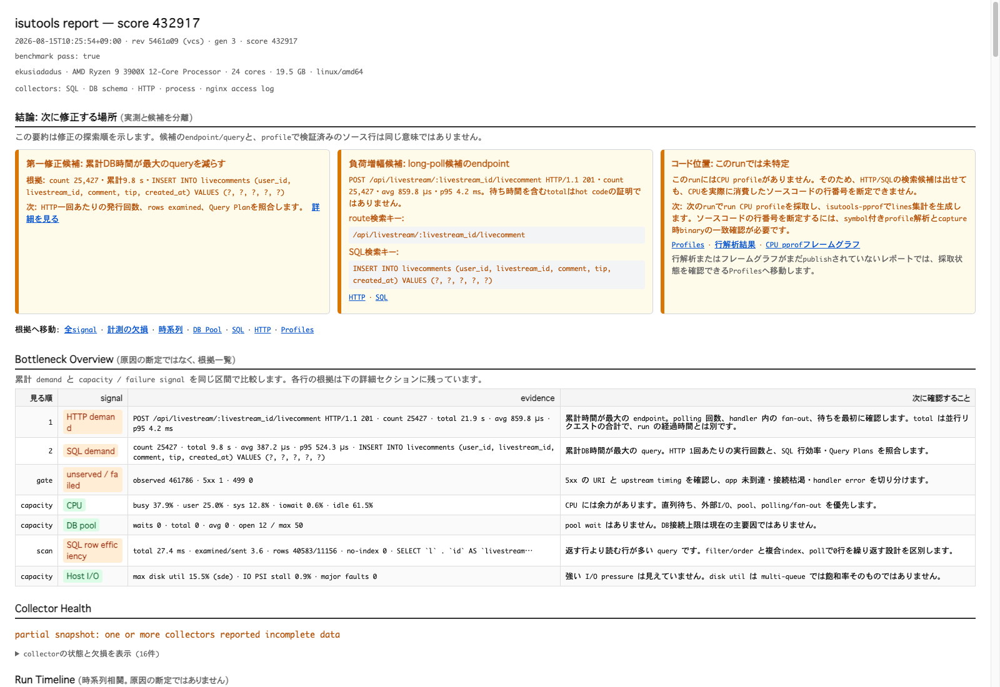
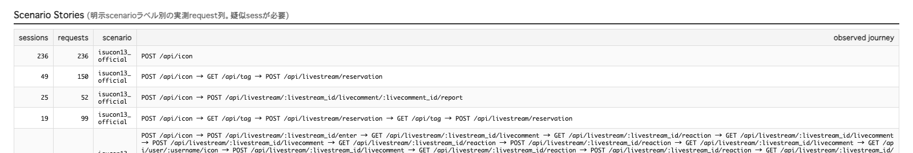
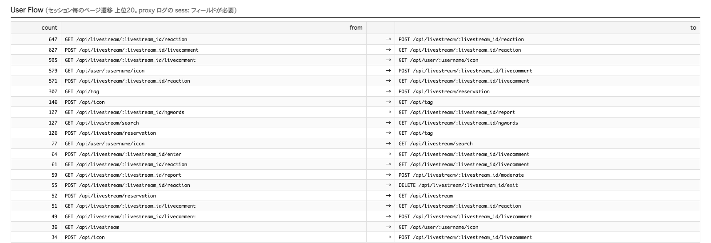

# isutools

[](https://pkg.go.dev/github.com/ekusiadadus/isutools)
[](https://github.com/ekusiadadus/isutools/actions/workflows/ci.yml)
[](./LICENSE)

[English](./README.en.md) | **日本語**

**ISUCONの1回のベンチを、SQL・HTTP・proxy log・pprof・host資源・scoreまで同じ証拠として保存します。**

「次にどこを直すか」「変更後に本当に改善したか」「そのrunを比較してよいか」を、
1つのダッシュボードと自己完結HTMLで判断するGo向け計測ツールです。



## 3分で導入

Go 1.24以上が必要です。

```bash
go get github.com/ekusiadadus/isutools@latest
```

アプリのDB driver名とHTTP handlerを包みます。

```go
db, err := sql.Open(isutools.SQLDriverName("mysql"), dsn)
if err != nil {
	log.Fatal(err)
}

log.Fatal(http.ListenAndServe(":8080", isutools.HTTP(mux)))
```

ベンチごとに同じ境界で保存します。

```bash
curl -fsS -X POST http://127.0.0.1:19191/reset
# benchmark command
curl -fsS -X POST 'http://127.0.0.1:19191/save?score=12345'
```

管理画面は既定で`127.0.0.1:19191`です。公開bindせずSSH転送してください。
DB pool、EXPLAIN、nginx、pprofまで含む手順は[導入ガイド](./docs/INTEGRATION.md)にあります。

## 何が分かるか

| 機能 | シンプルな答え |
|---|---|
| Bottleneck Overview | SQL、HTTP、DB pool、CPU、I/Oのうち、次に確認する場所 |
| SQL / HTTP | 遅い1回だけでなく、回数を含む累計コストとp95 |
| Runs / Diff | 変更前後のscore、失敗、total、count、averageの差 |
| User Flow | 同じ疑似sessionが実際に通ったページ遷移の上位20 |
| Scenario Stories | 明示scenarioごとの実測request列、session数、request数 |
| Profiles / Host | CPU実行なのか、DB・I/O・connection待ちなのか |
| Offline / Specialist tools | 過去log、slow query外れ値、pprof/trace/PGOを同じrunへ安全に接続 |
| Collector Health | 欠損・打ち切り・設定不備があり、そのrunを比較すべきでないか |

JSON、live dashboard、自己完結HTMLは同じrunから生成されます。推測で原因を断定せず、
候補と根拠を並べ、scoreとcorrectnessを最後の採用条件にします。
pprof解析をpublishしたrunでは、Runsの`current UI`からコード位置カードの`行解析結果`と
`CPU pprofフレームグラフ`へ直接移動できます。未解析時はProfilesへフォールバックします。

## User Flow / Scenario Stories

`isutools.HTTP`はmiddlewareでCookieをHMAC疑似sessionへ変換し、登録済みroute templateと
一緒にアプリ内で集計します。生Cookieやsession tokenをproxy logへ書かず、nginx以外でも
同じUser Flow / Scenario Storiesを取得できます。

```bash
export ISUTOOLS_FLOW_LABELS=on
export ISUTOOLS_SESSION_COOKIE=SESSIONID
export ISUTOOLS_SESSION_HMAC_KEY='32-byte以上のgitへ入れない乱数'
export ISUTOOLS_SCENARIO=isucon13_official
export ISUTOOLS_FLOW_SOURCE=middleware
```

handler単位のscenarioとrouter templateには、全公開ISUCONで使われたGorilla mux、Martini、
Goji v2、Echo v3/v4/v5、httprouter、chi v5に加えてGin adapterがあります。

```go
echov4.Install(e)
e.GET("/checkout", checkout, echov4.Scenario("checkout"))

ginadapter.Install(r)
r.GET("/checkout", ginadapter.Scenario("checkout"), checkout)

chiv5.Install(r)
r.With(chiv5.Scenario("checkout")).Get("/checkout", checkout)
```

`ISUTOOLS_FLOW_LABELS=off`ならflow label処理だけを停止し、`ISUTOOLS=off`なら全計測を停止します。
public clientが送った`X-Isutools-Session` / `X-Isutools-Scenario`は信用しません。
`ISUTOOLS_FLOW_SOURCE=proxy`は従来のtrusted response header方式、`off`はflow集計停止です。
全ISUCON回とproxyの一覧は[互換性表](./docs/isucon-compatibility.md)、設定断片は
[proxy例](./examples/proxies/README.md)を参照してください。

## 実測ストーリー

### private-isu: score 0から541,650へ

同一環境で1日dogfoodingし、score 0の初期runから`541,650`、fail 0まで改善しました。
一般的な性能保証ではなく、この環境・workload・変更履歴に限定した結果です。

1. 各変更を`reset → benchmark → save`でrevisionとscoreへ結び付ける。
2. SQL/HTTP累計時間から、繰り返し読む投稿・ユーザー経路を優先する。
3. diffで消えたコストと新しい退行を確認し、correctnessを通った変更だけ残す。

run一覧には途中の失敗やrollbackも残ります。


画像の比較runではscore `140,914 → 541,650`。diffでは、支配的だった2つの
`posts JOIN users` queryの累計`352.2s`と`109.6s`が消えた一方、新しく増えたqueryも赤で残るため、
scoreだけでなく「何を減らし、何が増えたか」を確認できます。


[改善手順と全記録](https://ekusiadadus.com/ja/blog/private-isu-500k-with-isutools)

### ISUCON13: 空だったflowを実測データへ

`matsuu/wsl-isucon`のISUCON13 Go初期実装へ疑似sessionとscenarioを導入しました。
ON/OFF smoke、header spoof防止、公式ベンチまで確認しました。画像のrunは`pass=true`、
score `11,928`、proxy log 11,701行、User Flow / Scenario Stories各上位20件です。
HTTP互換性のreview修正後も、現行binaryで`pass=true`、score `11,983`を再確認しています。

Scenario Storiesでは、例えば49 sessionが
`POST /api/icon → GET /api/tag → POST /api/livestream/reservation`を通ったことが分かります。



User Flowでは、reaction取得から投稿への遷移647回など、単独endpoint集計だけでは見えない
高頻度loopを確認できます。



これは観測経路の改善実証であり、性能改善の主張ではありません。10 block ABBAでも2%以下という
厳格な性能gateを通過できなかったため、その結果も含めて
[実機検証記録](./docs/isucon13-wsl-flow-verification-20260814.md)に残しています。

2026-08-15にはaccess log、slow log / pt-query-digest、runtime profile / trace、pprof、PGOを
同じ実機で通し直しました。PGOはA-B-B-Aで改善せずrollbackしたため、機能成立と性能採用を分けた
[specialist-tool実測記録](./docs/isucon13-specialist-tools-verification-20260815.md)として公開しています。
さらに固定revisionからfresh private-isuを別volumeで構築し、`pass=true, score=0`の統合run、
781件のaccess log、2,032件のslow-query event、matching binaryによるpprofまで再確認しました。
score 0は性能成果ではなく、初期構成の機能成立だけを示します。

## 対応範囲

| 領域 | 対応 |
|---|---|
| Database / KV | MySQL / MariaDB / PostgreSQL / SQLite (`database/sql`)、Redis command collector |
| HTTP | Go `net/http`、Gorilla mux、Martini、Goji v2、Echo v3/v4/v5、httprouter、Gin、chi v5 |
| Proxy log | nginx/OpenResty、Apache/OpenLiteSpeed、H2O、Envoy、Caddy、HAProxy、Traefik、lighttpd、Varnish、ATS、IIS、Squid |
| Runtime | CPU、mutex、block、heap、allocs、goroutine、threadcreate、対応時goroutineleak、trace |
| Host | Linux procfs / sysfs / cgroup v2、network、DB pool |
| Output | Live dashboard、JSON、自己完結HTML、run間diff、multi-host hub |

## 主な設定

| 環境変数 | 用途 |
|---|---|
| `ISUTOOLS=off` | 全計測を停止 |
| `ISUTOOLS_ADDR` | 管理server。既定`127.0.0.1:19191` |
| `ISUTOOLS_DATA_DIR` | snapshot / profileの永続保存先 |
| `ISUTOOLS_ACCESS_LOG` | proxy access log |
| `ISUTOOLS_ACCESS_LOG_FORMAT` | 明示decoder (`isutools-ltsv` / `isutools-json-v1` / `caddy-json` / `traefik-json` / `iis-w3c`) |
| `ISUTOOLS_FLOW_LABELS` | User Flow / Scenario Storiesを`on` / `off` / `auto` |
| `ISUTOOLS_FLOW_SOURCE` | flow集計元。既定`auto`、`middleware` / `proxy` / `off` |
| `ISUTOOLS_PPROF_SECONDS` | benchmark区間のCPU profile秒数 |
| `ISUTOOLS_TRACE_SECONDS` | 1〜30秒の短いexecution trace。既定off、managed profileと排他 |
| `ISUTOOLS_TIMELINE` | boundedなrun時系列をopt-in |

### CPU profileがないとき（`cpu-busy`）

`cpu-busy`はCPU使用率が高いという意味ではありません。同じGoプロセスで、前のrunまたは
手動`/pprof/profile`がprocess-wide CPU profilerを使っているため、新しい採取を開始できない状態です。
別の採取が終わるのを待ち、`POST /reset`の応答で
`X-Isutools-CPU-Profile-State: capturing`を確認してから、ベンチ、`POST /save`、
`isutools-pprof`解析の順で1回だけ再計測してください。

全設定、API、endpoint、EXPLAIN権限、複数台構成はREADMEへ重複させず、次へ集約しています。

- [導入ガイド](./docs/INTEGRATION.md)
- [ALP / pt-query-digest / pprof / PGOプレイブック](./docs/SPECIALIST_TOOLS.md)
- [外部解析の脅威モデルと上限](./docs/SECURITY_EXTERNAL_ANALYSIS.md)
- [設計とセキュリティ境界](./DESIGN.md)
- [実装状況](./docs/IMPLEMENTATION_STATUS.md)
- [現場フィードバックと運用上の注意](./docs/FIELD_FEEDBACK.md)
- [private-isu例](./examples/private-isu/README.md)
- [ISUCON13 WSL2例](./examples/isucon13-wsl/README.md)
- [ISUCON13 / fresh private-isu specialist tools実測](./docs/isucon13-specialist-tools-verification-20260815.md)
- [2026-08-14 ISUCON13現場指摘の最終監査](./docs/isucon13-field-audit-20260814.md)
- [ISUCON14 case study](./docs/case-studies/isucon14-20260805.md)

## 開発

```bash
go test ./...
go test -race ./...
go vet ./...
```

adapterは独立Go moduleです。CIではrootと全framework adapterを個別に検証します。

## License

[MIT](./LICENSE)
