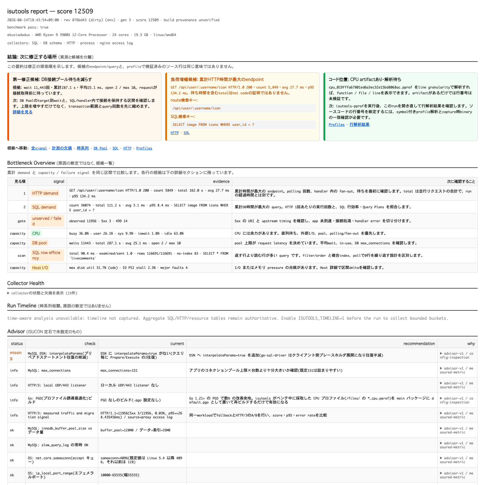

# ISUCON13現場指摘の最終監査（2026-08-14）

`ekusiadadus@ssh.almightty.org`の既存WSL2 distribution `isucon13`で、公式
ISUCON13 Go初期実装にisutoolsの計測配線だけを入れ、現場指摘を再監査した記録です。
アプリのSQL、index、cache、connection pool上限、PowerDNS、business logicは変更していません。

## 結論

最終公式ベンチは終了code 0、最終check成功、`pass=true`、score `12,509`でした。
isutools snapshotは`valid=true`、`partial=false`で、SQL 56種、HTTP 42種、nginx access log
11,956行を収集しました。scoreは環境とrunで変動するため、性能改善の証拠にはしていません。

この追試で、既存実装だけでは満たせない4件を新たに発見し、issue化しました。

- [#39 SQL placeholder-only IN listのarityをcomment除去後に丸める](https://github.com/ekusiadadus/isutools/issues/39)
- [#40 同じrunへの二重`/save`でscore/passを変更できないようにする](https://github.com/ekusiadadus/isutools/issues/40)
- [#41 ISUCON13検証記録の誤ったOFF環境変数名を直す](https://github.com/ekusiadadus/isutools/issues/41)
- [#42 derived flameが有効でも「解析待ち」と表示される診断を直す](https://github.com/ekusiadadus/isutools/issues/42)

## 指摘ごとの再監査

| 指摘 | 判定 | ISUCON13での証拠と境界 |
|---|---|---|
| `/save`が400 | 解決 | `POST /save?score=1710&pass=true`自体は正しい。`pass`がtrue/false以外なら400 `invalid-pass`、data dir未設定なら400 `data-dir-unset`。正常runの初回saveは200。追試で同runの再送が別scoreを保存できる問題を発見し、#40で409 `run-already-saved`へ修正した。再送前後で追加file 0、coordinator更新0を実機・自動testで確認した。 |
| access logの`/xxxx/`丸め | 解決 | exampleへ15本のfull-match ruleを追加。最終snapshotでraw usernameとraw numeric livestream IDはいずれも0。未一致pathは`keep`。ruleは登録順なので、長いpathを先にする。 |
| SQLの`/* */`以下を無視 | 解決 | commentは常に正規化前に除去する。defaultの先頭safe tagだけは集計用途で保持でき、`ISUTOOLS_SQL_COMMENT_TAGS=off`なら全commentを除去する。hint、任意comment、制御文字は保持しない。 |
| `IN /* */ (?, ?, ?)` | #39で解決 | comment除去、literal masking後にplaceholder-only `IN`/`NOT IN`を`IN (?)`へ集約する。MySQL `?`、PostgreSQL `$1`、literal listを含み、subqueryとrow constructorは丸めない。ISUCON13最終runには該当SQLが自然発生しなかったため、実moduleをリモートでtestした証拠であり、workload観測とは区別する。 |
| pprof flame | 解決 | run CPU profileをhash固定bundleへfetchし、Linux cgroup v2で512 MiB memory、swap 0、4 GiB address space、SIGSTOP、membership readbackを満たして解析・publishした。CPU flameはinterval/ready、2048 node上限、binary match verified。唯一のpartial理由は`source-path-redacted`。 |
| nginx session | 実装済み、今回未配線 | HMAC pseudonymをupstream response headerで渡し、inbound spoof headerを消す実装とtestはある。ISUCON13 exampleはsession別分析を必要としないため秘密鍵を新設せず、この単一app追試には配線していない。 |
| 複数台対応 | 実装済み、今回未実証 | SSH-only tunnel、hub/agent、required/optional peer、lease、host別集計の実装とtestはある。ただし今回の公式WSL環境はapp/nginx/MySQL/PowerDNSが同一distributionなので、複数host運用の実証にはしていない。 |
| Echo対応 | 解決 | framework-neutralな`httpstats.SetRoutePattern`とEcho v4/v5 adapterがある。最終snapshotでEcho templateへ集約された。文字どおり全Go frameworkの専用adapterがあるという主張はせず、generic APIを互換contractとする。 |
| 環境変数のみでOFF | 解決 | shipped contractどおり`ISUTOOLS=off`を一時systemd overrideで設定し、競技HTTPS 200を維持したまま管理listenerが消えることを実機確認。overrideを回収可能なbackupへ移してrun modeに戻し、4 service activeを再確認した。 |
| サジェスト | 解決 | advisor各行にrule version、category、source、freshness、scope、formula、actual value/unit、limitation、docs anchorを保持し、最終snapshot/UIでprovenanceを確認した。 |
| DB | 解決 | target単位のcapability matrixで`supported`、`partial`、`unsupported`、`config-missing`、`version-unsupported`、`unverified`、`failed`を明示する。最終MySQL targetでSQL aggregateとDB poolを確認した。PostgreSQLはSQL/poolのみ対応し、MySQL専用機能を無言で省略しない。 |

## 最終runと保存成果物

| 項目 | 値 |
|---|---|
| wsl-isucon revision | `876bd43a6f6f1048b8d341b2ab62d7afff01efd2` |
| isutools revision | `6003f82f6dd0a8076beaff8ac23df136f10b7f96` |
| app binary SHA-256 | `055015c58ce83b5c210f1b2001791398a80c80151a29b4541248d82da5a7919a` |
| run ID | `run-faf6ae6946bed25f` |
| snapshot base | `20260814-184354.414131215-000001_gen3_876bd43-dirty_score12509` |
| snapshot JSON SHA-256 | `abc4a536596b05d70186f39d4088a668027c97009e3bcac4e191b79bd7a6d10b` |
| snapshot HTML SHA-256 | `9bc3af2e1791037e9029114ba1bf526c8d5a5487442ce09b8c956a52f4acdb1e` |
| official result SHA-256 | `5646f2bcc7423a12dbbdfc20ce485e7048ab03cdffcbac24b3b730fde44654ee` |
| control-PC copy | `~/isutools-isucon13-results` |

`make bench`は`reset -> 公式bench -> collect -> save -> stage`を一つの境界として実行し、
`saved_file`、`snapshot_base`、`snapshot_sha256`を表示します。解析・SCPではこのbase/hashを指定し、
mtimeや「最新ファイル」から推測しません。公式`/tmp/result.json`も直ちにWSL ext4へcopyします。

## flame解析の証跡

| 項目 | 値 |
|---|---|
| analysis ID | `fe2516f5ae949ce86067b2ce3d86236f942f725bd84d342c2ad92a019ddf6336` |
| published artifact ID | `ceea141ca3c2b51f383e055a316f43f26bdc8d2f11897ac0cbeb6d2dad8a457c` |
| CPU profile SHA-256 | `b69dd77440976ddfe27a743bd108f4f95ef11ec88e45745f958470221c661414` |
| rendered profile HTML SHA-256 | `fd132e635f7744e827915cca138a9a5eaf9c97f7d2d481cbaacf27f015c29a69` |
| analysis JSON SHA-256 | `9dca3c2c1d54120289245cda6e5f45ccba2e923acd31c1be25f377936aa39dae` |



[Flame viewを含む全ページ画像](./images/isutools-isucon13-wsl-flame-ready.png)も保存しています。
画像は保存済み自己完結HTMLを制御PCのChrome headlessで描画したものです。管理APIへのSSH relay、
`/json`応答、report hashは別々に確認しています。対話ブラウザ拡張はlocalhost navigationを
`ERR_BLOCKED_BY_CLIENT`で遮断したため、この画像を「対話ブラウザで管理画面を開いた証拠」とは
表現しません。

## 再実行と確認コマンド

詳細手順は[`examples/isucon13-wsl`](../examples/isucon13-wsl/README.md)にあります。

```bash
make -C examples/isucon13-wsl status
make -C examples/isucon13-wsl check
make -C examples/isucon13-wsl bench
make -C examples/isucon13-wsl fetch
make -C examples/isucon13-wsl tunnel
```

最終変更後にroot、Echo v4、Echo v5で`go test -race ./...`と`go vet ./...`を実行し、
rootでは通常の`go test ./... -count=1`も実行しました。SQL comment/IN、access-log rule、
二重save、derived flame診断には回帰testがあります。
