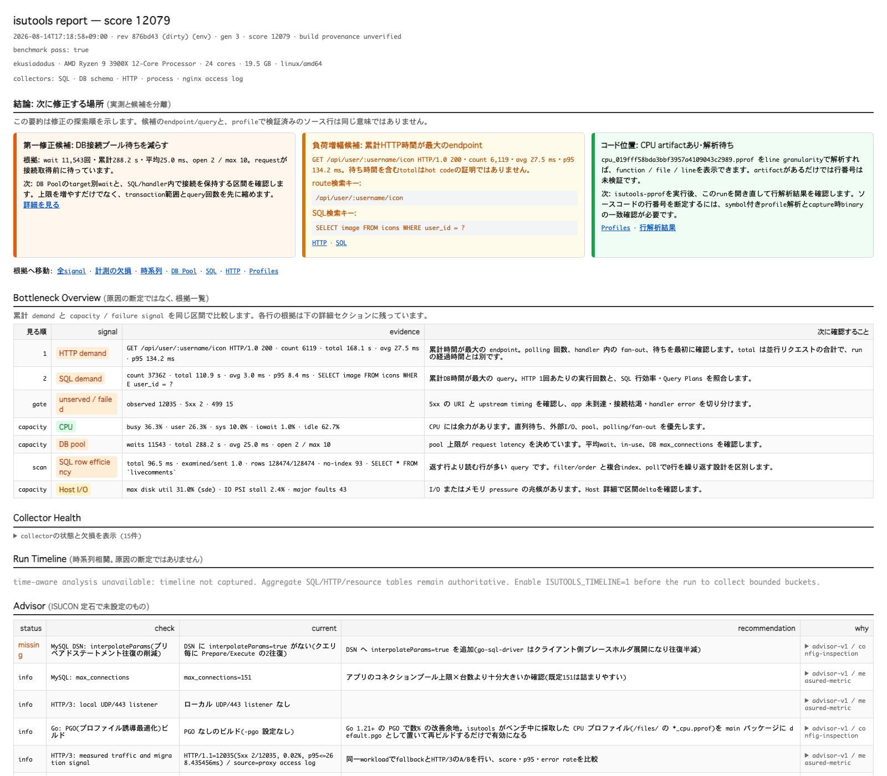

# ISUCON13 WSL2実機検証（2026-08-14）

Windows/WSL2上の公式ISUCON13 Go初期実装へ、アプリの挙動や性能を変更するチューニングを
加えず、isutoolsの計測配線だけを追加して確認した記録です。検証先は
`ekusiadadus@ssh.almightty.org`ですが、認証情報やhost固有の秘密は成果物へ保存していません。

## 検証範囲と出典

| 項目 | 固定値 |
|---|---|
| WSL distribution | `isucon13` |
| OS | Ubuntu 22.04.3 LTS（`/etc/os-release`では22.04） |
| 公式checkout | `matsuu/wsl-isucon` `876bd43a6f6f1048b8d341b2ab62d7afff01efd2` |
| isutools dependency | `4111f0c3935040f6e0546f44e55ed332ae51b7ce` |
| アプリ | `/home/isucon/webapp/go`、`isupipe-go.service` |
| isutools管理port | `127.0.0.1:19196` |
| 永続保存先 | `/home/isucon/isutools-data`（WSL ext4） |
| 制御PC copy | `~/isutools-isucon13-results` |

公式READMEに従い、DNS port `1053`、`*.u.isucon.local`、自己署名TLSを使い、
`./bench run --dns-port 1053 --enable-ssl`を実行しました。構築方法と前提は
[matsuu/wsl-isucon ISUCON13 README](https://github.com/matsuu/wsl-isucon/tree/main/isucon13)、
[build.ps1](https://github.com/matsuu/wsl-isucon/blob/main/isucon13/build.ps1)、競技コードは
[isucon/isucon13](https://github.com/isucon/isucon13)を参照しています。

変更したのは次の計測配線だけです。

- `SQLDriverName`、`RegisterDBTarget`、`WatchDBPool`
- Echo v4 route template adapterとHTTP middleware
- isutools専用nginx LTSV access log
- loopback管理port、run境界CPU profile、永続data directory

インデックス、SQL本文、cache、PowerDNS、business logic、connection pool上限は変更して
いません。スコア差は性能改善・性能劣化の結論には使いません。

## 実行結果

計測前の基準runは公式ベンチが終了code 0、最終check成功、`pass=true`、score `13,296`でした。
計測配線後は三度公式ベンチを実行し、いずれも終了code 0、最終check成功でした。三度目は
local `replace`を使わず、公開済み固定SHAをGo module proxyから解決したbinaryです。

| run | 公式結果 | isutools run | 用途 |
|---|---|---|---|
| 1 | `pass=true`, score `11,945` | `run-eeea4ce6b1debbac` | SQL/HTTP/access log/CPU profileの初回確認 |
| 2 | `pass=true`, score `11,884` | `run-5f384f1f7c26afa1` | DB poolを含むlocal source確認 |
| 3 | `pass=true`, score `12,079` | `run-df7e35a4139403c2` | 固定SHA・`replace=none`の最終確認 |

最終binaryのSHA-256は`f96d8f7e550ce3be6bf01bff38e52f2531cfa21ef5af035999b2f20c4969a7fd`です。
`go list -m`ではrootが`v1.5.1-0.20260814080837-4111f0c39350`、Echo adapterが
`v0.0.0-20260814080837-4111f0c39350`、Echoが`v4.11.1`で、`go.mod`に`replace`はありません。

最終snapshotは`valid`かつ`partial=false`で、collector healthはSQL、HTTP、access log、
DB pool、run CPU profile、profile provenanceがすべて`ok`、droppedは0でした。

| 内容 | 最終runの値 |
|---|---:|
| SQL集約行 | 56 |
| HTTP集約行 | 41 |
| nginx access log集約行 | 1,626 |
| DB pool target | `app` |
| DB pool | max-open 10、open 2、idle 2、wait-count 11,543 |
| run境界 | 2026-08-14 17:17:13–17:18:58 JST |

Echo route adapterにより、HTTP keyは例えば`/api/user/:username/icon`と
`/api/livestream/:livestream_id/livecomment`へ集約され、実usernameやlivestream IDを
集約keyにしていません。DB capabilityには`sql_aggregate=supported`と
`db_pool=supported`が記録されました。

## 保存形式、場所、hash

`make bench`は公式JSONをWSL ext4へ即時copyし、isutoolsの自己完結JSON/HTML、CPU profile、
profile manifestをWindows共有directoryへstageしたあと、SCPで制御PCへ取得します。

| 成果物 | SHA-256 |
|---|---|
| `20260814-171858.902906426-000001_gen3_876bd43-dirty_score12079.json` | `184248801f40d482643d130cf6bd7472d03cb59351edec4c6d777b7673503d66` |
| 同名`.html` | `2dc665b00fcf834357cc8e950ee8626519dee05658a616577628b360c55bd988` |
| `official-benchmark-20260814-171858-run-df7e35a4139403c2.json` | `97bc3b206e7fd9b00e75075ccf95fab2aa9b0a02d50919edaf465494fe3ff7bc` |
| `cpu_019fff58bda3bbf3957a4109043c2989.pprof` | `2668c38f604f3d74e08e39c63a747702a3583a04a5a291a9fbd515cc5e458cb3` |
| CPU profile manifest | `4096b45964f5f9b482ceeda4c6e9d9024fdf0ce62e89789f016f3b1201891691` |

リモートと制御PCの上記hashは一致しました。`wsl.exe -t isucon13`の前後でもext4上の
保存済み成果物hashは一致し、4 service、HTTPS、管理APIが再起動後に復帰しました。一方、
公式の`/tmp/result.json`はWSL停止で消えるため、永続保存先には使っていません。

## CPU profile、OFF、port forward

run profile manifestは`state=published`、`durability=durable`、coverage `complete=true`です。
`go tool pprof -top`で104.94秒のcaptureと162.40秒のsampleを読み出せました。manual endpointも
run modeを一時的にoffにして5秒captureを取得できましたが、idle中でsample 0のため、これは
endpointとcopy経路だけの確認です。通常の解析には上記run profileを使います。

`ISUTOOLS=off`の一時systemd overrideでは、競技HTTPSを維持したまま管理listenerが消えることを
確認し、override削除後に元のrun modeへ戻しました。一時overrideは検証後に残していません。

Windows SSH daemonとWSLが別network namespaceなので、単純な
`ssh -L 19196:127.0.0.1:19196`では接続できません。exampleの`make tunnel`は現在のWSL guest IPを
取得し、guest側の限定relayとSSH forwardを同一lifecycleで起動します。relay経由の`/json`応答を
確認し、管理server自体は`127.0.0.1:19196`から外部bindしていません。

## UI証跡

最終自己完結HTMLを制御PCのChrome headlessで1600×1400 PNGへ描画しました。これは保存済み
reportの表示確認であり、公式ベンチの成否は上記公式JSONとrun metadataで別に判定しています。

利用手順は[`examples/isucon13-wsl`](../examples/isucon13-wsl/README.md)にまとめ、
`make status`、`make check`、`make bench`、`make tunnel`、`make pprof`、OFF/rollbackを記載しました。

## 既知の環境差

- `kmod-static-nodes.service`と`ssh.service`はfailedですが、競技4 serviceとは別です。
- `nginx`、`mysql`、`pdns`、`isupipe-go`はすべてactive、公式HTTPSはHTTP 200です。
- Windows browserのhosts登録は管理者権限が必要です。isutools UIのSSH転送にはhosts登録は不要です。
- 検証に使ったChrome環境ではlocalhost navigationをextension policyが遮断したため、保存HTMLの
  headless描画とrelay `/json`の通信確認を別々に行いました。
